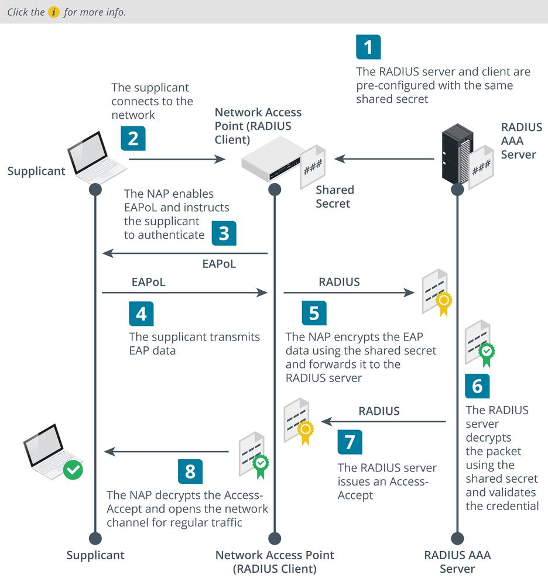

# Remote Authentication Dial-in User Service

#### REMOTE AUTHENTICATION DIAL-IN USER SERVICE

The **Remote Authentication Dial-in User Service (RADIUS)** standard is published as an Internet standard. There are several RADIUS server and client products.

The Network Access Server (NAS) device (RADIUS client) is configured with the IP address of the RADIUS server and with a shared secret. This allows the client to authenticate to the server. Remember that the client is the access device (switch, access point, or VPN gateway), not the user's PC or laptop. A generic RADIUS authentication workflow proceed as follows:

1.  The user's device (the supplicant) makes a connection to the NAS appliance, such as an access point, switch, or remote access server.

_RADIUS authentication with EAP overview. (Images © 123RF.com.)_

2.  The NAS prompts the user for their authentication credentials. RADIUS supports PAP, CHAP, and EAP. Most implementations now use EAP, as PAP and CHAP are not secure. If EAP credentials are required, the NAS enables the supplicant to transmit **EAP over LAN (EAPoL)** data, but does not allow any other type of network traffic.
3.  The supplicant submits the credentials as EAPoL data. The RADIUS client uses this information to create an Access-Request RADIUS packet, encrypted using the shared secret. It sends the Access-Request to the AAA server using UDP on port 1812 (by default).
4.  The AAA server decrypts the Access-Request using the shared secret. If the Access-Request cannot be decrypted (because the shared secret is not correctly configured, for instance), the server does not respond.
5.  With EAP, there will be an exchange of Access-Challenge and Access-Request packets as the authentication method is set up and the credentials verified. The NAS acts as a pass-thru, taking RADIUS messages from the server, and encapsulating them as EAPoL to transmit to the supplicant.
6.  At the end of this exchange, if the supplicant is authenticated, the AAA server responds with an Access-Accept packet; otherwise, an Access-Reject packet is returned.

Optionally, the NAS can use RADIUS for accounting (logging). Accounting uses port 1813. The accounting server can be different from the authentication server.