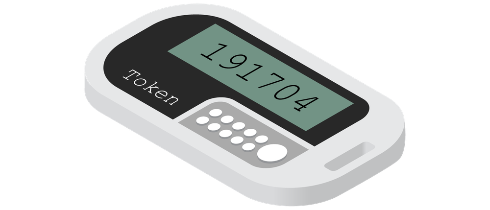

# Token Keys and Static Codes

#### TOKEN KEYS AND STATIC CODES

Smart-card authentication works well when you have close control over user accounts and the devices used on the network. Other types of ownership-based authentication technologies use various hardware and software **tokens**. These avoid some of the management issues of using the digital certificates required by smart-card authentication.

A **one-time password (OTP)** is one that is generated automatically, rather than being chosen by a user, and used only once. Consequently, it is not vulnerable to password guessing or sniffing attacks. An OTP is generated using some sort of hash function on a secret value plus a synchronization value (seed), such as a timestamp or counter.

_Key fob token generator. (Image © 123RF.com.)_

The SecurID token from RSA represents one popular implementation of an OTP token key. The device generates a passcode based on the current time and a secret key coded into the device. The code is entered along with a PIN or password known only to the user. Network access devices must be configured with an agent to intercept the credentials and direct them to an Authentication Manager server for validation. This server can integrate with directory products, such as AD.

There are also simpler token keys and smart cards that simply transmit a static token programmed into the device. For example, many building entry systems work on the basis of static codes. These mechanisms are highly vulnerable to cloning and replay attacks.

There are many other ways of implementing hardware token keys. For example, a Fast Identity Online (FIDO) Universal Second Factor (U2F) USB token registers a public key with the authentication service. The authentication mechanism then requires the private key locked to the token, which is authorized using PIN or fingerprint activation ([fidoalliance.org/showcase/fido-u2f-security-key](https://course.adinusa.id/sections/token-keys-and-static-codes)). This can also be used with the Windows Hello authentication provider ([microsoft.com/security/blog/2019/06/10/advancing-windows-10-passwordless-platform](https://course.adinusa.id/sections/token-keys-and-static-codes)).
