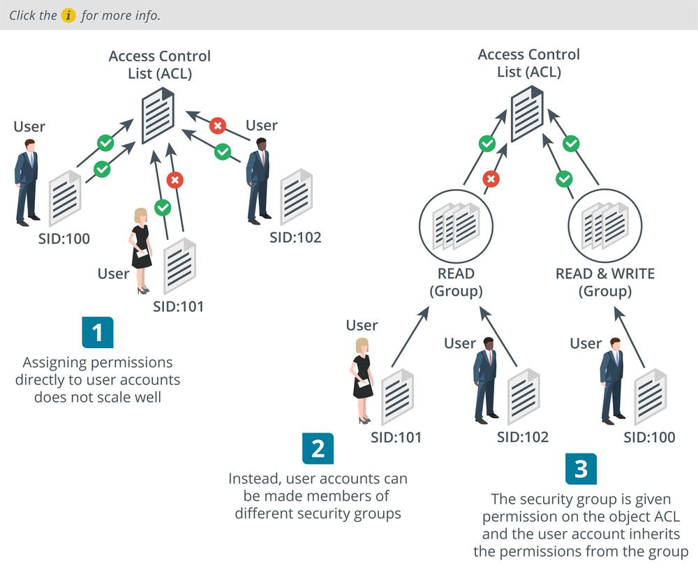

# Security Group-Based Privileges

#### SECURITY GROUP-BASED PRIVILEGES

As well as an account to use resources on the local computer, users also typically need accounts to use resources on the network. In fact, most accounts are created on a network directory and then given permission to log in on certain computer or workstation objects.

One approach to network privilege management is to assign privileges directly to user accounts. This model is only practical if the number of users is small. With large number of users, it is difficult to audit and to apply privilege policies consistently.

The concept of a security **group account** simplifies and centralizes the administrative process of assigning rights. Rather than assigning rights directly, the system owner assigns them to security group accounts. User accounts gain rights by being made a member of a security group. A user can be a member of multiple groups and can therefore receive rights and permissions from several sources.

_Using security groups to assign privileges. (Images © 123RF.com.)_