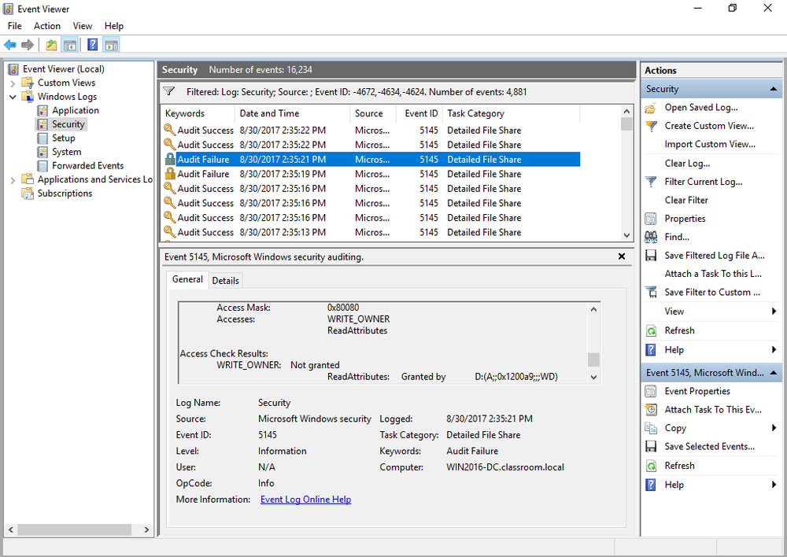

# Account Audits

#### ACCOUNT AUDITS

Accounting and auditing processes are used to detect whether an account has been compromised or is being misused. A security or audit log can be used to facilitate detection of account misuse:

-   Accounting for all actions that have been performed by users. Change and version control systems depend on knowing when a file has been modified and by whom. Accounting also provides for non-repudiation (that is, a user cannot deny that they accessed or made a change to a file). The main problems are that auditing successful access attempts can quickly consume a lot of disk space, and analyzing the logs can be very time-consuming.
    
-   Detecting intrusions or attempted intrusions. Here records of failure-type events are likely to be more useful, though success-type events can also be revealing if they show unusual access patterns.

_Recording an unsuccessful attempt to take ownership of an audited folder. (Screenshot used with permission from Microsoft.)_

Account auditing also refers to more general change control. You need to take account of changes to resources and users. Resources may be updated, archived, or have their clearance level changed. Users may leave, arrive, or change jobs (roles). For example, if a user has moved to a new job, old privileges may need to be revoked and new ones granted. This process is referred to as recertification. Managing these sorts of changes efficiently and securely requires effective standard operating procedures (SOPs) and clear and timely communication between departments (between IT and HR, for instance).