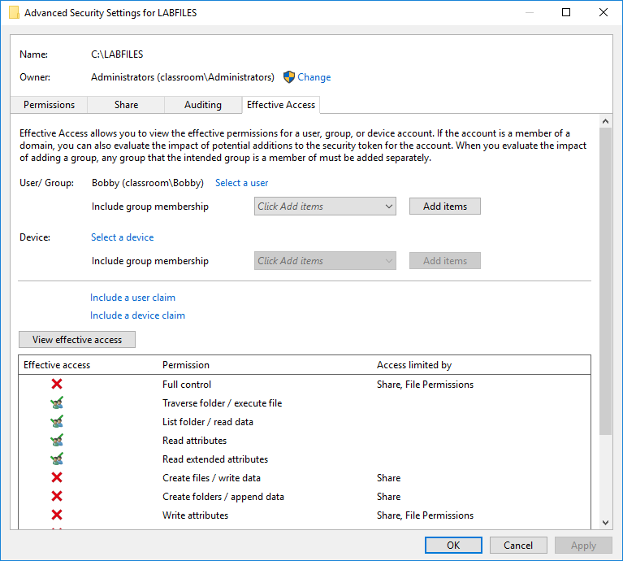

# Account Permissions

#### ACCOUNT PERMISSIONS

Where many users, groups, roles, and resources are involved, managing account permissions is complex and time-consuming. Improperly configured accounts can have two different types of impact. On the one hand, setting privileges that are too restrictive creates a large volume of support calls and reduces productivity. On the other hand, granting too many privileges to users weakens the security of the system and increases the risk of things like malware infection and data breach.

> _The phrase "authorization creep" refers to an employee who gains more and more access privileges the longer they remain with the organization._

A user may be granted elevated privileges temporarily (escalation). In this case, some system needs to be in place to ensure that the privileges are revoked at the end of the agreed period.

A system of auditing needs to be put in place so that privileges are reviewed regularly. Auditing would include monitoring group membership and reviewing access control lists for each resource plus identifying and disabling unnecessary accounts.

_Determining effective permissions for a shared folder. (Screenshot used with permission from Microsoft.)_