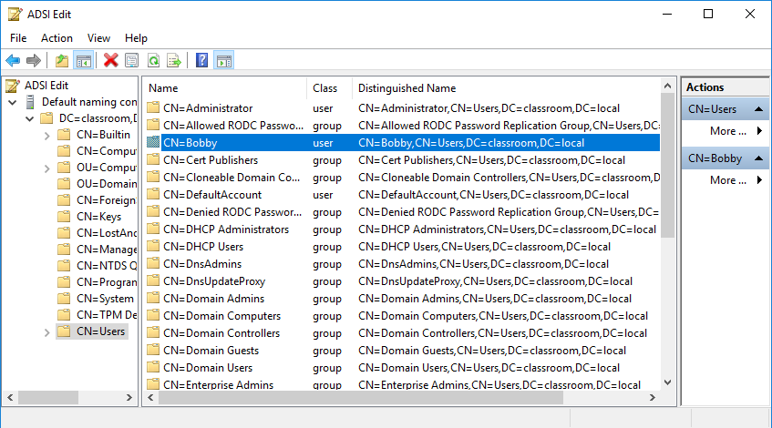

# Directory Services

#### DIRECTORY SERVICES

**Directory services** are the principal means of providing privilege management and authorization on an enterprise network, storing information about users, computers, security groups/roles, and services. A directory is like a database, where an object is like a record, and things that you know about the object (attributes) are like fields. In order for products from different vendors to be interoperable, most directories are based on the same standard. The Lightweight Directory Access Protocol (LDAP) is a protocol widely used to query and update X.500 format directories.

A distinguished name (DN) is a unique identifier for any given resource within an X.500-like directory. A distinguished name is made up of attribute=value pairs, separated by commas. The most specific attribute is listed first, and successive attributes become progressively broader. This most specific attribute is also referred to as the relative distinguished name, as it uniquely identifies the object within the context of successive (parent) attribute values.

_Browsing objects in an Active Directory LDAP schema. (Screenshot used with permission from Microsoft.)_

The types of attributes, what information they contain, and the way object types are defined through attributes (some of which may be required, and some optional) is described by the directory schema. Some of the attributes commonly used include common name (CN), organizational unit (OU), organization (O), country (C), and domain component (DC). For example, the distinguished name of a web server operated by Widget in the UK might be:

`CN=WIDGETWEB, OU=Marketing, O=Widget, C=UK, DC=widget, DC=foo`