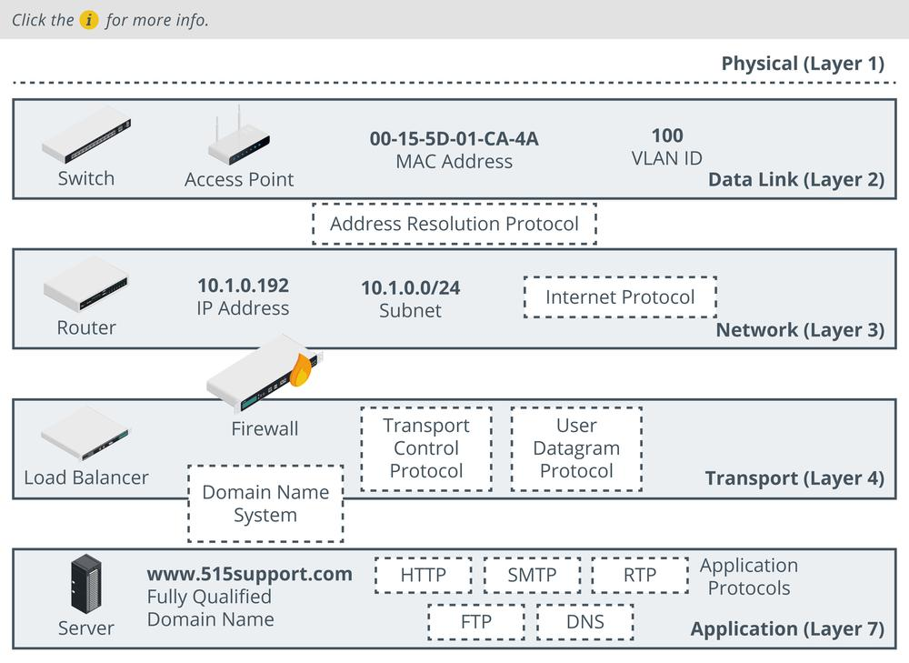

# Network Appliances

#### NETWORK APPLIANCES

A number of network appliances are involved in provisioning a network architecture:

-   **Switches**—forward frames between nodes in a cabled network. Switches work at layer 2 of the OSI model and make forwarding decisions based on the hardware or Media Access Control (MAC) address of attached nodes. Switches can establish network segments that either map directly to the underlying cabling or to logical segments, created in the switch configuration as **virtual LANs (VLANs)**.

> _When designing and troubleshooting a network, it is helpful to compartmentalize functions to discrete layers. The Open Systems Interconnection (OSI) model is a widely quoted example of how to define layers of network functions._

-   Wireless access points—provide a bridge between a cabled network and wireless clients, or stations. Access points work at layer 2 of the OSI model.
    
-   **Routers**—forward packets around an internetwork, making forwarding decisions based on IP addresses. Routers work at layer 3 of the OSI model. Routers can apply logical IP subnet addresses to segments within a network.
    
-   Firewalls—apply an access control list (ACL) to filter traffic passing in or out of a network segment. Firewalls can work at layer 3 of the OSI model or higher.
    
-   Load balancers—distribute traffic between network segments or servers to optimize performance. Load balancers can work at layer 4 of the OSI model or higher.
    
-   Domain Name System (DNS) servers—host name records and perform name resolution to allow applications and users to address hosts and services using fully qualified domain names (FQDNs) rather than IP addresses. DNS works at layer 7 of the OSI model. Name resolution is a critical service in network design. Abuse of name resolution is a common attack vector.

_Appliances, protocols, and addressing functions within the OSI network layer reference model. (Images © 123RF.com.)_