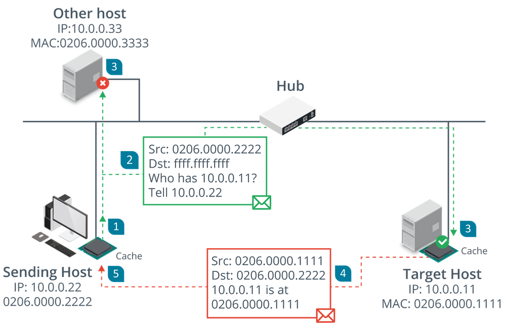

# Routing and Switching Protocols

#### ROUTING AND SWITCHING PROTOCOLS

The basic function of a network is to forward traffic from one node to another. A number of routing and switching protocols are used to implement forwarding. The forwarding function takes place at two different layers:

-   Layer 2 forwarding occurs between nodes on the same local network segment that are all in the same broadcast domain. At layer 2, a broadcast domain is either all the nodes connected to the same physical unmanaged switch, or all the nodes within a virtual LAN (VLAN) configured on one or more managed switches. At layer 2, each node is identified by the network interface's hardware or Media Access Control (MAC) address. A MAC address is a 48-bit value written in hexadecimal notation, such as 00-15-5D-F4-83-48.
    
-   Layer 3 forwarding, or routing, occurs between both logically and physically defined networks. A single network divided into multiple logical broadcast domains is said to be subnetted. Multiple networks joined by routers form an internetwork. At layer 3, nodes are identified by an Internet Protocol (IP) address.
    

**Address Resolution Protocol (ARP)**  
The Address Resolution Protocol (ARP) maps a network interface's hardware (MAC) address to an IP address. Normally a device that needs to send a packet to an IP address but does not know the receiving device's MAC address broadcasts an ARP Request packet, and the device with the matching IP responds with an ARP Reply.

_ARP in action—An ARP broadcast is used when there is no MAC:IP mapping in the cache and is received by all hosts on the same network, but only the host with the requested IP should reply. (Images © 123RF.com.)_

**Internet Protocol (IP)**  
IP provides the addressing mechanism for logical networks and subnets. A 32-bit IPv4 address is written in dotted decimal notation, with either a network suffix or subnet mask to divide the address into network ID and host ID portions. For example, in the IP address 172.16.1.101/16, the /16 suffix indicates that the first half of the address (172.16.0.0) is the network ID, while the remainder uniquely identifies a host on that network. This /16 suffix can also be written as a subnet mask in the form 255.255.0.0.

Networks also use 128-bit IPv6 addressing. IPv6 addresses are written using hex notation in the general format: 2001:db8::abc:0:def0:1234. In IPv6, the last 64-bits are fixed as the host's interface ID. The first 64-bits contain network information in a set hierarchy. For example, an ISP's routers can use the first 48-bits to determine where the network is hosted on the global Internet. Within that network, the site administrator can use the 16 bits remaining (out of 64) to divide the local network into subnets.

**Routing Protocols**  
Information about how to reach individual networks within an internetwork is processed by routers, which store the data in a routing table. A route to a network can be configured statically, but most networks use **routing protocols** to transmit new and updated routes between routers. Some common routing protocols include **Border Gateway Protocol (BGP)**, **Open Shortest Path First (OSPF)**, **Enhanced Interior Gateway Routing Protocol (EIGRP)**, and **Routing Information Protocol (RIP)**.