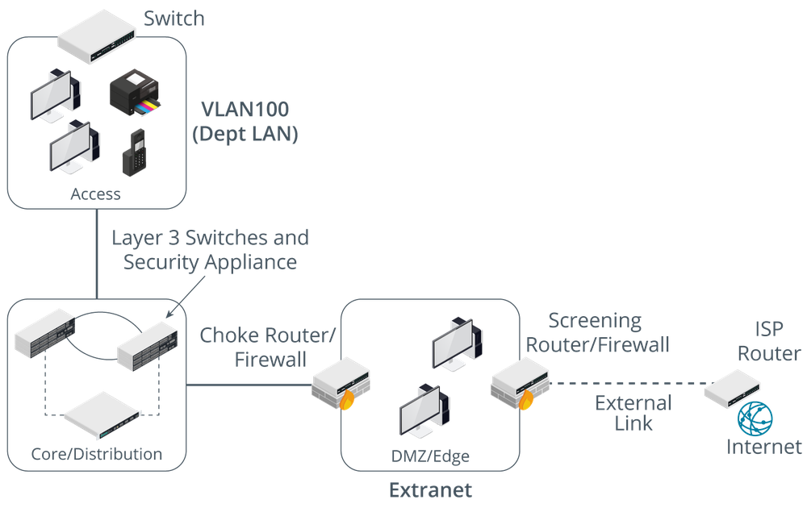
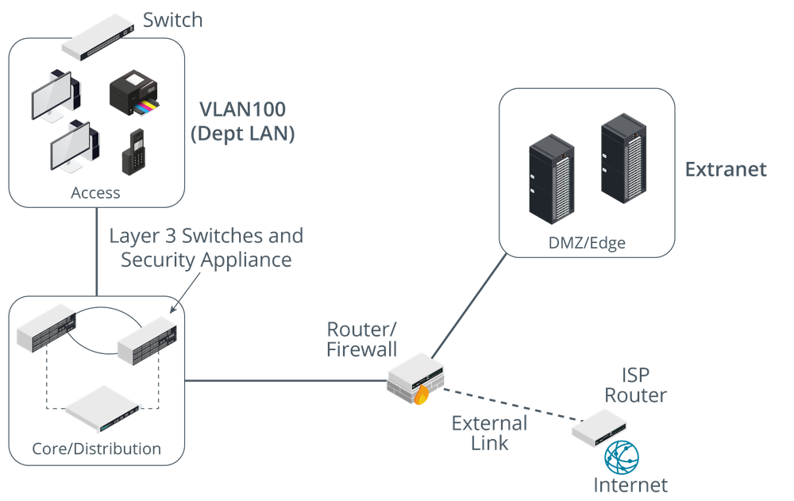

# Demilitarized Zone Topologies

#### DEMILITARIZED ZONE TOPOLOGIES

To configure a DMZ, two different security configurations must be enabled: one on the external interface and one on the internal interface. A DMZ and intranet are on different subnets, so communications between them need to be routed.

**Screened Subnet**  
A screened subnet uses two firewalls placed on either side of the DMZ. The edge firewall restricts traffic on the external/public interface and allows permitted traffic to the hosts in the DMZ. The edge firewall can be referred to as the screening firewall or router. The internal firewall filters communications between hosts in the DMZ and hosts on the LAN. This firewall is often described as the choke firewall. A choke point is a purposefully narrow gateway that facilitates better access control and easier monitoring.

_A screened subnet DMZ topology. (Images © 123RF.com.)_

**Triple-Homed Firewall**  
A DMZ can also be established using one router/firewall appliance with three network interfaces, referred to as triple-homed. One interface is the public one, another is the DMZ, and the third connects to the LAN. Routing and filtering rules determine what forwarding is allowed between these interfaces. This can achieve the same sort of configuration as a screened subnet.

_A triple-homed firewall DMZ topology. (Images © 123RF.com.)_