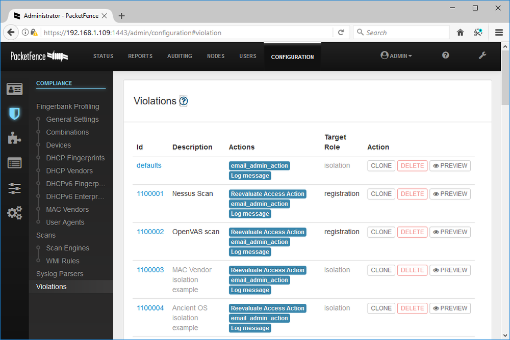
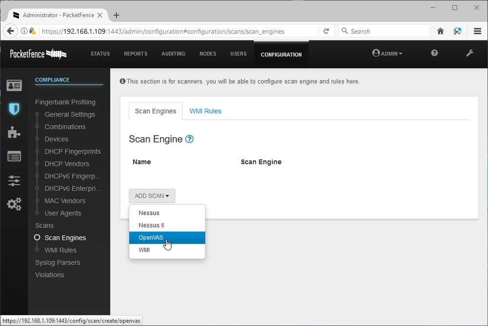

# Network Access Control

#### NETWORK ACCESS CONTROL

Endpoint security is a set of security procedures and technologies designed to restrict network access at a device level. Endpoint security contrasts with the focus on perimeter security established by topologies such as DMZ and technologies such as firewalls. Endpoint security does not replace these but adds defense in depth.

The IEEE 802.1X standard defines a **port-based network access control (PNAC)** mechanism. PNAC means that the switch uses an AAA server to authenticate the attached device before activating the port. **Network access control (NAC)** products can extend the scope of authentication to allow administrators to devise policies or profiles describing a minimum security configuration that devices must meet to be granted network access. This is called a health policy. Typical policies check things such as malware infection, firmware and OS patch level, personal firewall status, and the presence of up-to-date virus definitions. A solution may also be to scan the registry or perform file signature verification. The health policy is defined on a NAC management server along with reporting and configuration tools.

**Posture assessment** is the process by which host health checks are performed against a client device to verify compliance with the health policy. Most NAC solutions use client software called an agent to gather information about the device, such as its antivirus and patch status, presence of prohibited applications, or anything else defined by the health policy.

_Defining policy violations in Packet Fence Open Source NAC. (Screenshot used with permission from [packetfence.org](https://course.adinusa.id/sections/network-access-control).)_

An agent can be persistent, in which case it is installed as a software application on the client, or nonpersistent. A nonpersistent (or dissolvable) agent is loaded into memory during posture assessment but is not installed on the device.

_Packet Fence supports the use of several scanning techniques, including vulnerability scanners, such as Nessus and OpenVAS, Windows Management Instrumentation (WMI) queries, and log parsers. (Screenshot used with permission from [packetfence.org](https://course.adinusa.id/sections/network-access-control).)_

Some NAC solutions can perform agentless posture assessment. This is useful when the NAC solution must support a wide range of devices, such as smartphones, tablets, and Internet of Things (IoT) devices, but less detailed information about the client is available with an agentless solution.