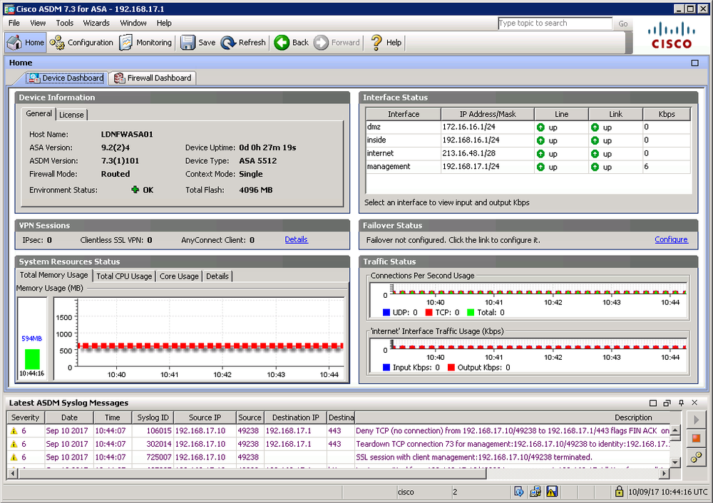

# Firewall Implementation

#### FIREWALL IMPLEMENTATION

You should consider how the firewall is implemented—as hardware or software, for instance—to cover a given placement or use on the network. Some types of firewalls are better suited for placement at the network edge or zonal borders; others are designed to protect individual hosts.

**Firewall Appliances**  
An **appliance firewall** is a stand-alone hardware firewall deployed to monitor traffic passing into and out of a network zone. A firewall appliance can be deployed in two ways:

-   Routed (layer 3)—the firewall performs forwarding between subnets. Each interface on the firewall connects to a different subnet and represents a different security zone.
    
-   Bridged (layer 2)—the firewall inspects traffic passing between two nodes, such as a router and a switch. This is also referred to as transparent mode. The firewall does not have an IP interface (except for configuration management). It bridges the Ethernet interfaces between the two nodes. Despite performing forwarding at layer 2, the firewall can still inspect and filter traffic on the basis of the full range of packet headers. The typical use case for a transparent firewall is to deploy it without having to reconfigure subnets and reassign IP addresses on other devices.

_Cisco ASA (Adaptive Security Appliance) ASDM (Adaptive Security Device Manager) interface. (Screenshot used with permission from Cisco.)_

A **router firewall** or firewall router appliance implements filtering functionality as part of the router firmware. The difference is that a router appliance is primarily designed for routing, with firewall as a secondary feature. SOHO Internet router/modems come with a firewall built-in, for example.

**Application-Based Firewalls**  
Firewalls can also run as software on any type of computing host. There are several types of application-based firewalls:

-   **Host-based firewall (or personal firewall)**—implemented as a software application running on a single host designed to protect that host only. As well as enforcing packet filtering ACLs, a personal firewall can be used to allow or deny software processes from accessing the network.
    
-   **Application firewall**—software designed to run on a server to protect a particular application only (a web server firewall, for instance, or a firewall designed to protect an SQL Server database). This is a type of host-based firewall and would typically be deployed in addition to a network firewall.
    
-   **Network operating system (NOS) firewall**—a software-based firewall running under a network server OS, such as Windows or Linux. The server would function as a gateway or proxy for a network segment.