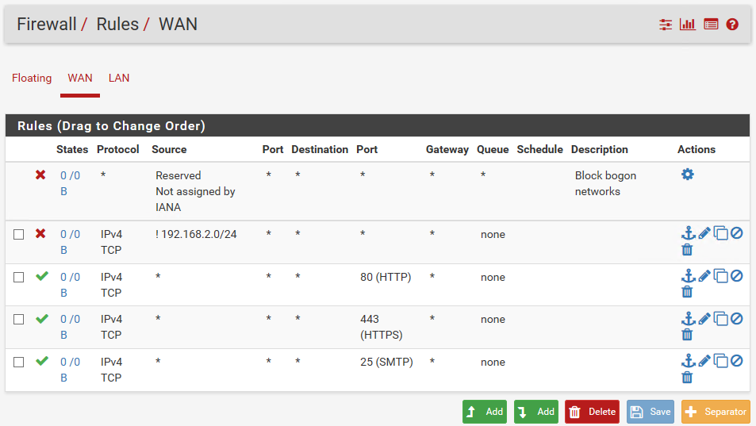
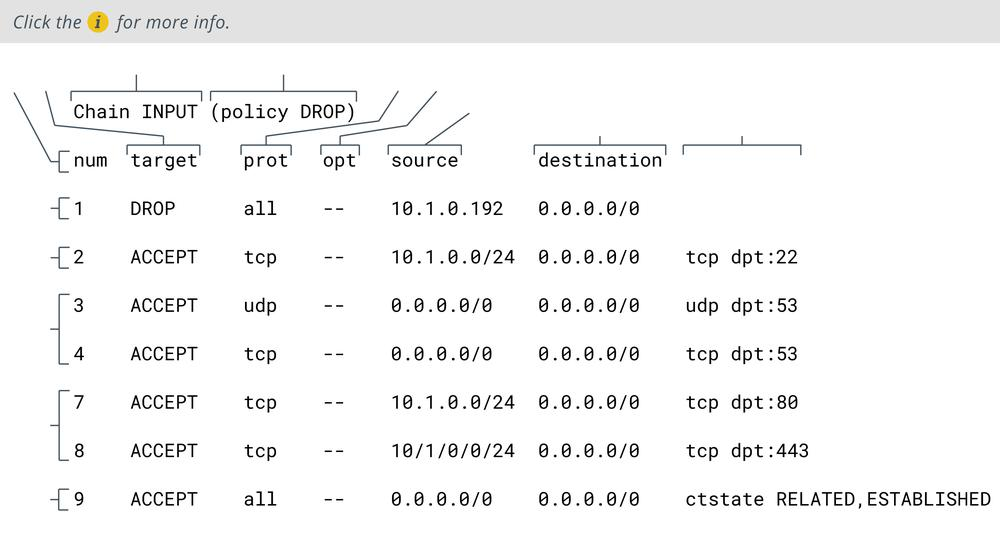

# Access Control Lists

#### ACCESS CONTROL LISTS

Firewall access control lists (ACLs) are configured on the principle of least access. This is the same as the principle of least privilege; only allow the minimum amount of traffic required for the operation of valid network services and no more. The rules in a firewall's ACL are processed top-to-bottom. If traffic matches one of the rules, then it is allowed to pass; consequently, the most specific rules are placed at the top. The final default rule is typically to block any traffic that has not matched a rule (**implicit deny**). If the firewall does not have a default implicit deny rule, an explicit deny all rule can be added manually to the end of the ACL.

_Sample firewall ruleset configured on pfSense. This ruleset blocks all traffic from bogon networks and a specific private address range but allows any HTTP, HTTPS, or SMTP traffic from any other source. (Screenshot used with permission from Rubicon Communications, LLC.)_

Each rule can specify whether to block or allow traffic based on several parameters, often referred to as tuples. If you think of each rule being like a row in a database, the tuples are the columns. For example, in the previous screenshot, the tuples include Protocol, Source (address), (Source) Port, Destination (address), (Destination) Port, and so on.

Even the simplest packet filtering firewall can be complex to configure securely. It is essential to create a written policy describing what a filter ruleset should do and to test the configuration as far as possible to ensure that the ACLs you have set up work as intended. Also test and document changes made to ACLs. Some other basic principles include:

-   Block incoming requests from internal or private IP addresses (that have obviously been spoofed).
    
-   Block incoming requests from protocols that should only be functioning at a local network level, such as ICMP, DHCP, or routing protocol traffic.
    
-   Use penetration testing to confirm the configuration is secure. Log access attempts and monitor the logs for suspicious activity.
    
-   Take the usual steps to secure the hardware on which the firewall is running and use of the management interface.

_Access control list entries shown using the command iptables --list INPUT --line-numbers -n._