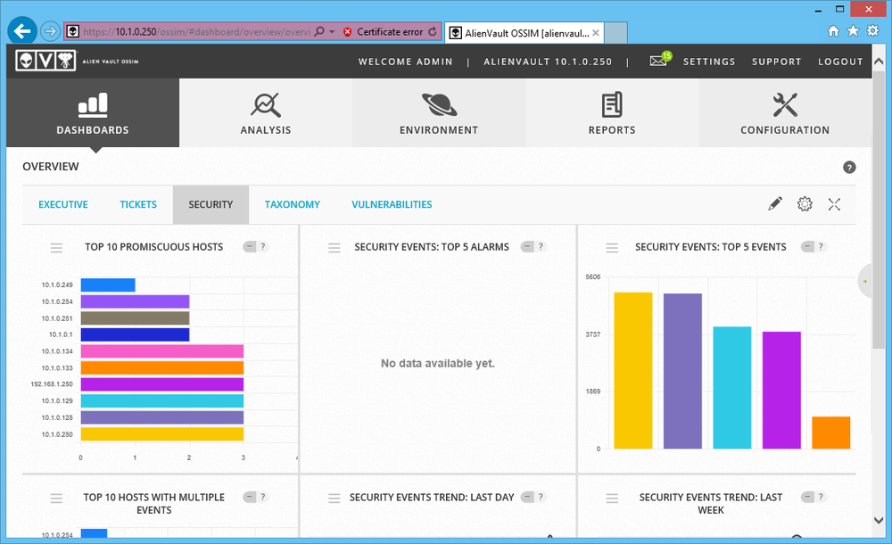
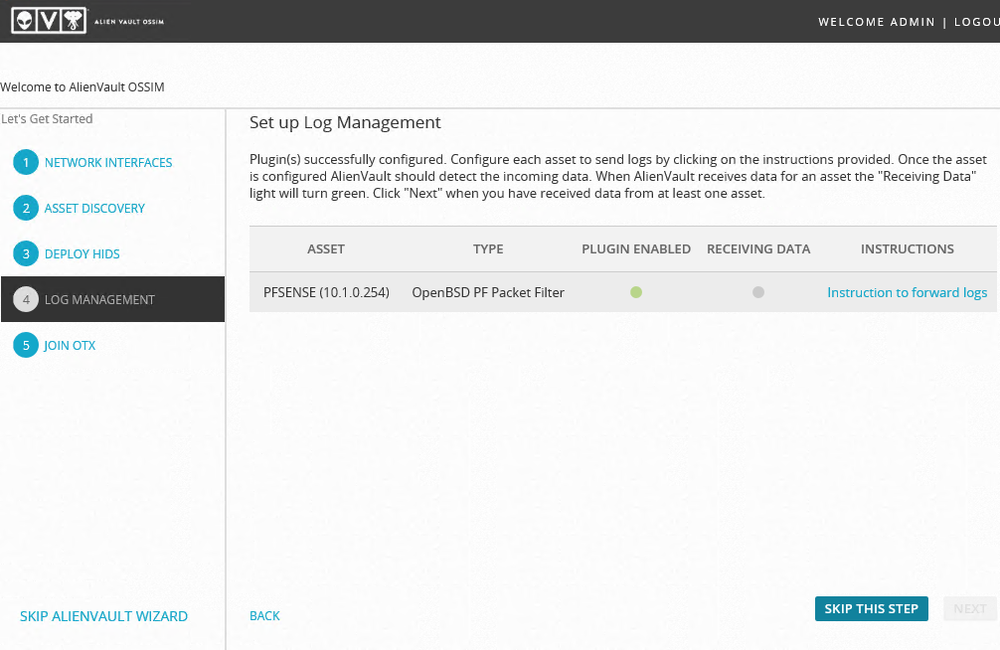

# Security Information and Event Management

#### SECURITY INFORMATION AND EVENT MANAGEMENT

Software designed to assist with managing security data inputs and provide reporting and alerting is often described as **security information and event management (SIEM)**. The core function of a SIEM tool is to aggregate traffic data and logs. In addition to logs from Windows and Linux-based hosts, this could include switches, routers, firewalls, IDS sensors, vulnerability scanners, malware scanners, data loss prevention (DLP) systems, and databases.

_OSSIM SIEM dashboard—Configurable dashboards provide the high-level status view of network security metrics. (Screenshot used with permission from AT&T Cybersecurity.)_

**Log Collection**  
The first task for SIEM is to collect data inputs from multiple sources. There are three main types of log collection:

-   Agent-based—with this approach, you must install an agent service on each host. As events occur on the host, logging data is filtered, aggregated, and normalized at the host, then sent to the SIEM server for analysis and storage.
    
-   **Listener/collector**—rather than installing an agent, hosts can be configured to push updates to the SIEM server using a protocol such as syslog or SNMP. A process runs on the management server to parse and normalize each log/monitoring source.
    

Syslog ([tools.ietf.org/html/rfc3164](https://course.adinusa.id/sections/security-information-and-event-management)) allows for centralized collection of events from multiple sources. It also provides an open format for event logging messages, and as such has become a de facto standard for logging of events from distributed systems. For example, syslog messages can be generated by Cisco routers and switches, as well as servers and workstations.

-   Sensor—as well as log data, the SIEM might collect packet captures and traffic flow data from sniffers.

_Enabling a log parser plug-in for a pfSense security appliance so that firewall events can be imported into the SIEM. (Screenshot used with permission from AT&T Cybersecurity.)_

**Log Aggregation**  
As distinct from collection, aggregation refers to normalizing data from different sources so that it is consistent and searchable. SIEM software features connectors or plug-ins to interpret (or parse) data from distinct types of systems and to account for differences between vendor implementations. Usually parsing will be carried out using regular expressions tailored to each log file format to identify attributes and content that can be mapped to standard fields in the SIEM's reporting and analysis tools. Another important function is to normalize date/time zone differences to a single timeline.