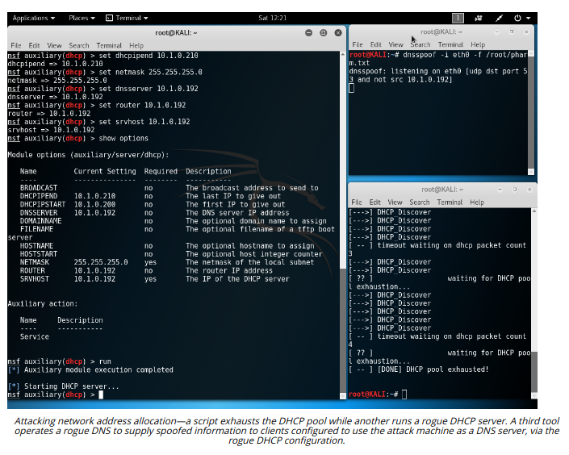

# Implement Secure Network Operations Protocols

> **EXAM OBJECTIVES COVERED**
> 
> _1.4 Given a scenario, analyze potential indicators associated with network attacks  
> 3.1 Given a scenario, implement secure protocols_

Unsecure protocols can be exploited by attackers to compromise data security and systems integrity. In this topic, you will examine some of the protocols and services providing addressing, name resolution, directory services, time synchronization, and monitoring services for network hosts. These network operations protocols might not be as visible as applications such as web and email servers, but they are critical to secure network infrastructure.

#### NETWORK ADDRESS ALLOCATION

Most networks use a mixture of static and dynamic address allocation. Interface addresses for routers, firewalls, and some types of servers are best assigned and managed manually. Other server services and client workstations can be assigned dynamic IP configurations and accessed using name resolution.

The Dynamic Host Configuration Protocol (DHCP) provides an automatic method for network address allocation. The key point about DHCP is that only one server should be offering addresses to any one group of hosts. If a rogue DHCP server is set up, it can perform DoS (as client machines will obtain an incorrect TCP/IP configuration) or be used to snoop network information. DHCP starvation is a type of DoS attack where a rogue client repeatedly requests new IP addresses using spoofed MAC addresses, with the aim of exhausting the IP address pool. This makes it more likely that clients seeking an address lease will use the rogue DHCP server.

Enabling the DHCP snooping port security feature on a switch can mitigate rogue DHCP attacks. Windows DHCP servers in an AD environment automatically log any traffic detected from unauthorized DHCP servers. More generally, administration of the DHCP server itself must be carefully controlled and the settings checked regularly. If an attacker compromises the DHCP server, he or she could point network clients to rogue DNS servers and use that as a means to direct users to spoofed websites. Another attack is to redirect traffic through the attacker's machine by changing the default gateway, enabling the attacker to snoop on all network traffic.

