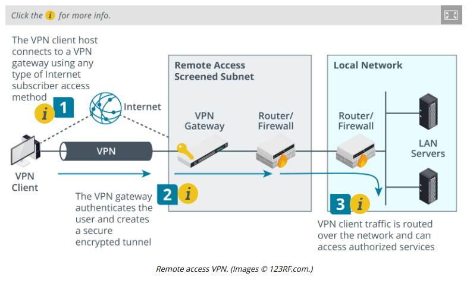
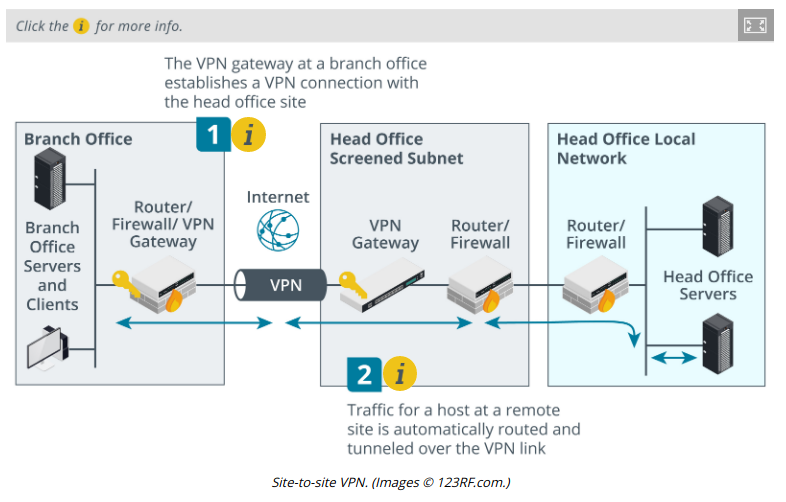

# Implement Secure Remote Access Protocols

> **EXAM OBJECTIVES COVERED**
> 
> _3.1 Given a scenario, implement secure protocols  
> 3.3 Given a scenario, implement secure network designs  
> 4.1 Given a scenario, use the appropriate tool to assess organizational security (SSH only)_

With today's mobile workforce, most networks have to support connections by remote employees, contractors, and customers to their network resources. These remote connections often make use of untrusted public networks, such as the Internet. Consequently, understanding how to implement secure remote access protocols will be a major part of your job as an information security professional.

There are also many cases where a user needs to remotely access an individual host. This is most commonly implemented to allow administrators to perform remote management of workstations, servers, and network appliances, but it can also be used to provide ordinary users access to a desktop as well.

#### REMOTE ACCESS ARCHITECTURE

Remote access means that the user's device does not make a direct cabled or wireless connection to the network. The connection occurs over or through an intermediate network. Historically, remote access might have used analog modems connecting over the telephone system or possibly a private link (a leased line). These days, most remote access is implemented as a **virtual private network (VPN)**, running over the Internet. Administering remote access involves essentially the same tasks as administering the local network. Only authorized users should be allowed access to local network resources and communication channels. Additional complexity comes about because it can be more difficult to ensure the security of remote workstations and servers and there is greater opportunity for remote logins to be exploited.

With a remote access VPN, clients connect to a VPN gateway on the edge of the private network. This is the "telecommuter" model, allowing home-workers and employees working in the field to connect to the corporate network. The VPN protocol establishes a secure **tunnel** so that the contents are kept private, even when the packets pass over ISPs' routers.

A VPN can also be deployed in a site-to-site model to connect two or more private networks. Where remote access VPN connections are typically initiated by the client, a site-to-site VPN is configured to operate automatically. The gateways exchange security information using whichever protocol the VPN is based on. This establishes a trust relationship between the gateways and sets up a secure connection through which to tunnel data. Hosts at each site do not need to be configured with any information about the VPN. The routing infrastructure at each site determines whether to deliver traffic locally or send it over the VPN tunnel.

