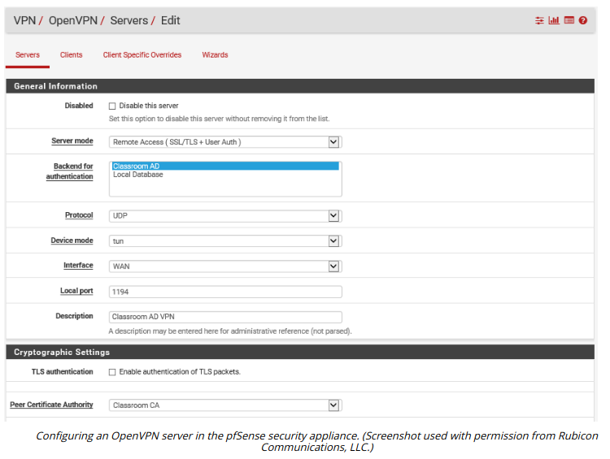
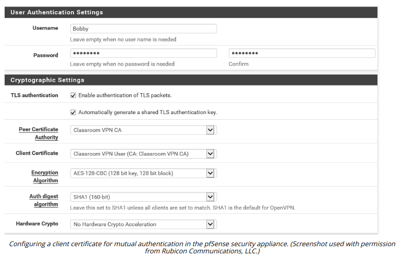

# TRANSPORT LAYER SECURITY VPN

#### TRANSPORT LAYER SECURITY VPN

Several VPN protocols have been used over the years. Legacy protocols such as the **Point-to-Point Tunneling Protocol (PPTP)** have been deprecated because they do not offer adequate security. Transport Layer Security (TLS) and IPSec are now the preferred options for configuring VPN access.

A TLS VPN (still more commonly referred to as an SSL VPN) requires a remote access server listening on port 443 (or any arbitrary port number). The client makes a connection to the server using TLS so that the server is authenticated to the client (and optionally the client's certificate must be authenticated by the server). This creates an encrypted tunnel for the user to submit authentication credentials, which would normally be processed by a RADIUS server. Once the user is authenticated and the connection fully established, the VPN gateway tunnels all communications for the local network over the secure socket.

> _The port can be either TCP or UDP. UDP might be chosen for marginally superior performance, especially when tunneling latency-sensitive traffic such as voice or video. TCP might be easier to use with a default firewall policy. TLS over UDP is also referred to as Datagram TLS (DTLS)._

OpenVPN is an open source example of a TLS VPN (openvpn.net). OpenVPN can work in TAP (bridged) mode to tunnel layer 2 frames or in TUN (routed) mode to forward IP packets. Another option is Microsoft's **Secure Sockets Tunneling Protocol (SSTP)**, which works by tunneling Point-to-Point Protocol (PPP) layer 2 frames over a TLS session (docs.microsoft.com/en-us/openspecs/windows\_protocols/ms-sstp/70adc1df-c4fe-4b02-8872-f1d8b9ad806a). The **Point-to-Point Protocol (PPP)** is a widely used remote dial-in protocol. It provides encapsulation for IP traffic plus IP address assignment and authentication via the widely supported Challenge Handshake Authentication Protocol (CHAP).