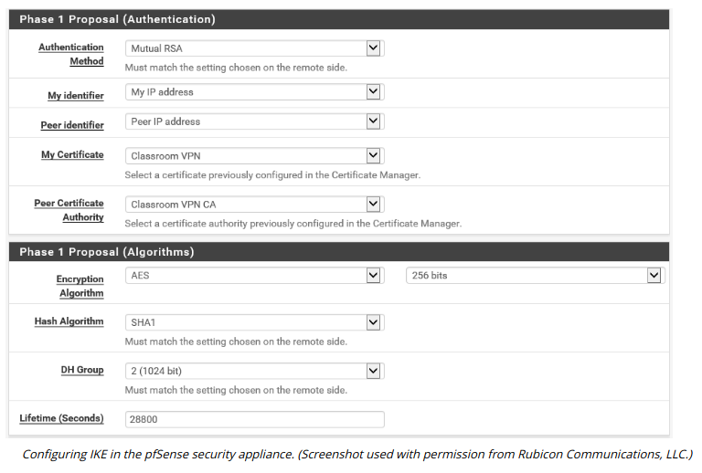

# INTERNET KEY EXCHANGE

#### INTERNET KEY EXCHANGE

IPSec's encryption and hashing functions depend on a shared secret. The secret must be communicated to both hosts and the hosts must confirm one another's identity (mutual authentication). Otherwise, the connection is vulnerable to man-in-the-middle and spoofing attacks. The **Internet Key Exchange (IKE)** protocol handles authentication and key exchange, referred to as Security Associations (SA).

IKE negotiations take place over two phases:

1.  Phase I establishes the identity of the two hosts and performs key agreement using the Diffie-Hellman algorithm to create a secure channel. Two methods of authenticating hosts are commonly used:
  

-   Digital certificates—the hosts use certificates issued by a mutually trusted certificate authority to identify one another.
  
-   Pre-shared key (group authentication)—the same passphrase is configured on both hosts.
  

4.  Phase II uses the secure channel created in Phase I to establish which ciphers and key sizes will be used with AH and/or ESP in the IPSec session.