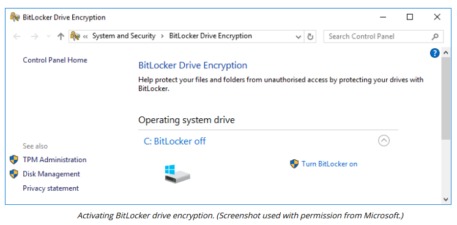

# DISK ENCRYPTION

#### DISK ENCRYPTION

**Full disk encryption (FDE)** means that the entire contents of the drive (or volume), including system files and folders, are encrypted. OS ACL-based security measures are quite simple to circumvent if an adversary can attach the drive to a different host OS. Drive encryption allays this security concern by making the contents of the drive accessible only in combination with the correct encryption key. Disk encryption can be applied to both hard disk drives (HDDs) and solid state drives (SSDs).

FDE requires the secure storage of the key used to encrypt the drive contents. Normally, this is stored in a TPM. The TPM chip has a secure storage area that a disk encryption program, such as Windows BitLocker, can write its keys to. It is also possible to use a removable USB drive (if USB is a boot device option). As part of the setup process, you create a recovery password or key. This can be used if the disk is moved to another computer or the TPM is damaged.

One of the drawbacks of FDE is that, because the OS performs the cryptographic operations, performance is reduced. This issue is mitigated by **self-encrypting drives (SED)**, where the cryptographic operations are performed by the drive controller. The SED uses a symmetric data/media encryption key (DEK/MEK) for bulk encryption and stores the DEK securely by encrypting it with an asymmetric key pair called either the authentication key (AK) or **key encryption key (KEK)**. Use of the AK is authenticated by the user password. This means that the user password can be changed without having to decrypt and re-encrypt the drive. Early types of SEDs used proprietary mechanisms, but many vendors now develop to the **Opal** Storage Specification (nvmexpress.org/wp-content/uploads/TCGandNVMe\_Joint\_White\_Paper-TCG\_Storage\_Opal\_and\_NVMe\_FINAL.pdf), developed by the Trusted Computing Group (TCG).

> _As configuring passwords on individual drives is a huge challenge when more than a few machines are involved, enterprises may use the Key Management Interoperability Protocol (KMIP) along with a hardware security module (HSM) to automate the provisioning of keys (trustedcomputinggroup.org/wp-content/uploads/SWG\_TCG\_Enterprise-Introduction\_Sept2010.pdf)._