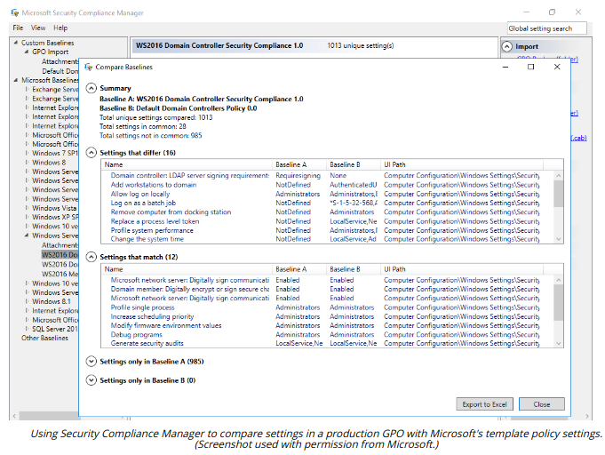

# BASELINE CONFIGURATION AND REGISTRY SETTINGS

#### BASELINE CONFIGURATION AND REGISTRY SETTINGS

You will have separate configuration baselines for desktop clients, file and print servers, Domain Name System (DNS) servers, application servers, directory services servers, and other types of systems. In Windows, configuration settings are stored in the registry. On a Windows domain network, each domain-joined computer will receive policy settings from one or more group policy objects (GPOs). These policy settings are applied to the registry each time a computer boots. Where hosts are centrally managed and running only authorized apps and services, there should be relatively little reason for security-relevant registry values to change. Rights to modify the registry should only be issued to user and service accounts on a least privilege basis. A host-based intrusion detection system can be configured to alert suspicious registry events.

Baseline deviation reporting means testing the actual configuration of hosts to ensure that their configuration settings match the baseline template. On Windows networks, the Microsoft Baseline Security Analyzer (MBSA) tool was popularly used to validate the security configuration. MBSA and other Microsoft reporting tools have now been replaced by the Security Compliance Toolkit (docs.microsoft.com/en-us/windows/security/threat-protection/security-compliance-toolkit-10).

