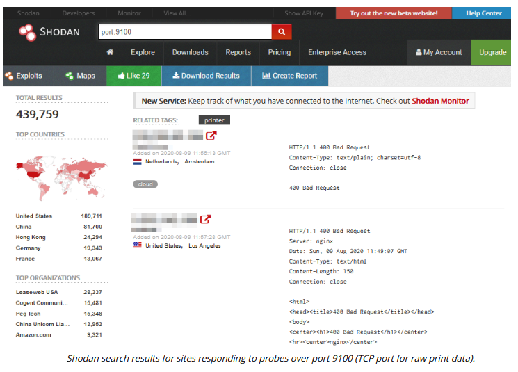

# SPECIALIZED SYSTEMS IN IT

#### SPECIALIZED SYSTEMS IN IT

There are also specialized systems installed within office networks, such as printer and Voice over IP (VoIP) equipment. These systems must not be overlooked by security monitoring procedures.

**Multifunction Printers (MFPs)**  
Most modern print devices, scanners, and fax machines have hard drives and sophisticated firmware, allowing their use without attachment to a computer and over a network. Often these print/scan/fax functions are performed by single devices, referred to as **multifunction printers (MFPs)**. Unless they have been securely deleted, images and documents are frequently recoverable from all of these machines. Some of the more feature-rich, networked printers and MFPs can also be used as a pivot point to attack the rest of the network. These machines also have their own firmware that must be kept patched and updated.

**Voice over IP (VoIP)**  
Types of embedded systems are used to implement both Voice over IP (VoIP) endpoints and media gateways. Endpoints can be individual handsets or conferencing units. A media gateway might use a separate firmware/OS to implement integration with telephone and cellular networks.

> _Where these devices connect directly to the Internet, a fingerprinting app or website (shodan.io/explore/tag/voip or shodan.io/explore/tag/printer, for instance) can be used to probe for unpatched vulnerabilities. There are Shodan queries for any number of IoT and ICS devices._

