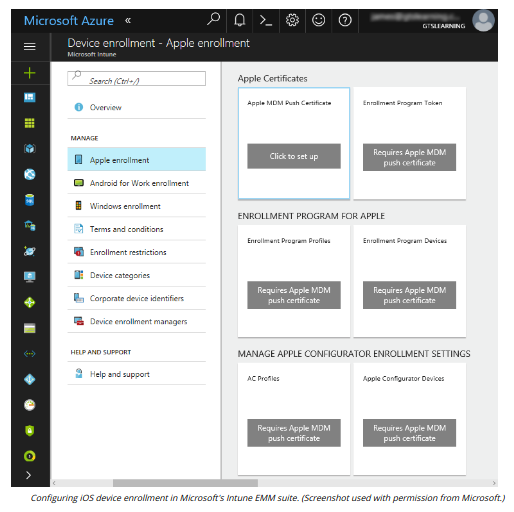

# IOS IN THE ENTERPRISE

#### IOS IN THE ENTERPRISE

In Apple's iOS ecosystem, third-party developers can create apps using Apple's Software Development Kit, available only on MacOS. Apps have to be submitted to and approved by Apple before they are released to users via the App Store. Corporate control over iOS devices and distribution of corporate and B2B (Business-to-Business) apps is facilitated by participating in the Device Enrollment Program (support.apple.com/business), the Volume Purchase Program, and the Developer Enterprise Program (developer.apple.com/programs/enterprise). Another option is to use an EMM suite and its development tools to create a "wrapper" for the corporate app.

Most iOS attacks are the same as with any system; users click malicious links or enter information into phishing sites, for instance. As a closed and proprietary system, it should not be possible for malware to infect an iOS device as all code is updated from Apple's servers only. There remains the risk that a vulnerability in either iOS or an app could be discovered and exploited. In this event, users would need to update iOS or the app to a version that mitigates the exploit.