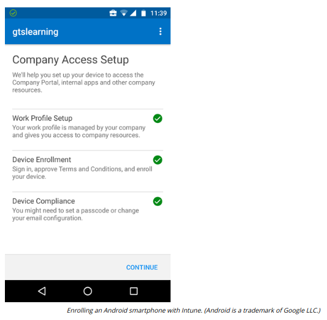
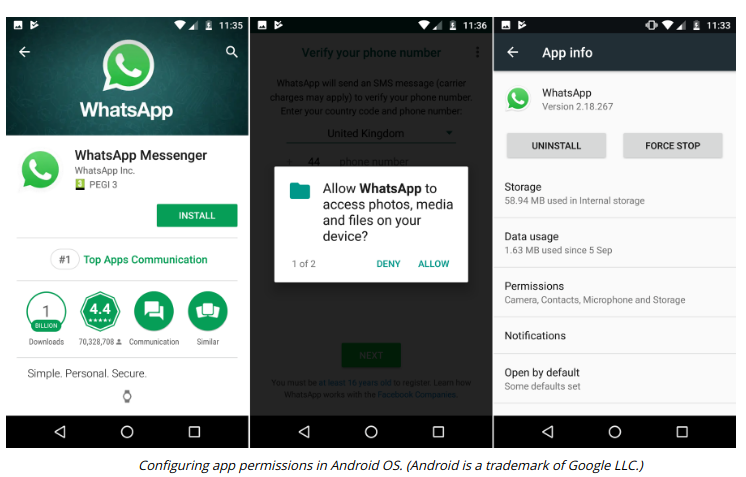

# ANDROID IN THE ENTERPRISE

#### ANDROID IN THE ENTERPRISE

Android's open source basis means that there is more scope for vendor-specific versions. The app model is also more relaxed, with apps available from both Google Play and third-party sites, such as Amazon's app store. The SDK is available on Linux, Windows, and macOS. The Android Enterprise (android.com/enterprise) program facilitates use of EMM suites and the containerization of corporate workspaces. Additionally, Samsung has a workspace framework called KNOX (samsung.com/us/business/solutions/samsung-knox) to facilitate EMM control over device functionality.

iOS devices are normally updated very quickly. With Android, the situation is less consistent, as updates often depend on the handset vendor to complete the new version or issue the patch for their flavor of Android. Android OS is more open and there is Android malware, though as with Apple it is difficult for would-be hackers and spammers to get it into any of the major app repositories.

> _One technique used is called Staged Payloads. The malware writers release an app that appears innocuous in the store but once installed it attempts to download additional components infected with malware (zdnet.com/article/android-security-sneaky-three-stage-malware-found-in-google-play-store). Google has implemented a server-side malware scanning product (Play Protect) that will both warn users if an app is potentially damaging and scan apps that have already been purchased, and warn the user if any security issues have been discovered._

Since version 4.3, Android has been based on Security-Enhanced Linux. **SEAndroid** (source.android.com/security/selinux) uses mandatory access control (MAC) policies to run apps in sandboxes. When the app is installed, access is granted (or not) to specific shared features, such as contact details, SMS texting, and email.

