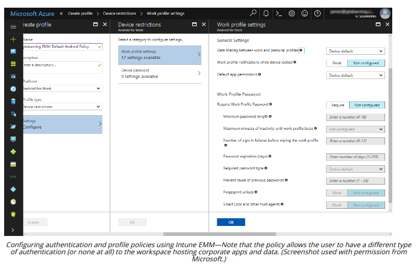

# MOBILE ACCESS CONTROL SYSTEMS

#### MOBILE ACCESS CONTROL SYSTEMS

If a threat actor is able to gain access to a smartphone or tablet, they can obtain a huge amount of information and the tools with which to launch further attacks. Quite apart from confidential data files that might be stored on the device, it is highly likely that the user has cached passwords for services such as email or remote access VPN and websites.

**Smartphone Authentication**  
The majority of smartphones and tablets are single-user devices. Access control can be implemented by configuring a screen lock that can only be bypassed using the correct password, PIN, or swipe pattern. Many devices now support biometric authentication, usually as a fingerprint reader but sometimes using facial or voice recognition.

> _Strong passwords should always be set on mobile devices, as simple 4-digit PIN codes can easily be brute-forced. Swipe patterns are vulnerable to poor user choices (arstechnica.com/information-technology/2015/08/new-data-uncovers-the-surprising-predictability-of-android-lock-patterns), such as choosing letter or box patterns, plus the tendency for the grease trail to facilitate a smudge attack._

**Screen Lock**  
The screen lock can also be configured with a lockout policy. This means that if an incorrect passcode is entered, the device locks for a set period. This could be configured to escalate (so the first incorrect attempt locks the device for 30 seconds while the third locks it for 10 minutes, for instance). This deters attempts to guess the passcode.

**Context-Aware Authentication**  
It is also important to consider newer authentication models, such as **context-aware authentication**. For example, smartphones now allow users to disable screen locks when the device detects that it is in a trusted location, such as the home. Conversely, an enterprise may seek more stringent access controls to prevent misuse of a device. For example, even if the device has been unlocked, accessing a corporate workspace might require the user to authenticate again. It might also check whether the network connection can be trusted (that it is not an open Wi-FI hotspot, for instance).