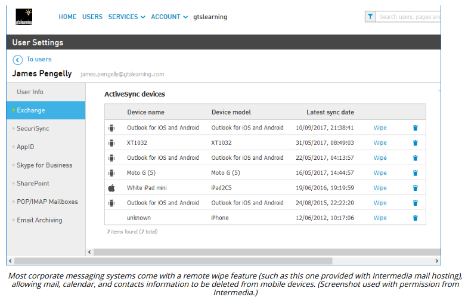

# REMOTE WIPE

#### REMOTE WIPE

A **remote wipe** or kill switch means that if the handset is stolen it can be set to the factory defaults or cleared of any personal data (sanitization). Some utilities may also be able to wipe any plug-in memory cards too. The remote wipe could be triggered by several incorrect passcode attempts or by enterprise management software. Other features include backing up data from the phone to a server first and displaying a "Lost/stolen phone—return to XX" message on the handset.

In theory, a thief can prevent a remote wipe by ensuring the phone cannot connect to the network, then hacking the phone and disabling the security.

##### FULL DEVICE ENCRYPTION AND EXTERNAL MEDIA

All but the early versions of mobile device OSes for smartphones and tablets provide full device encryption. In iOS, there are various levels of encryption.

  
-   All user data on the device is always encrypted but the key is stored on the device. This is primarily used as a means of wiping the device. The OS just needs to delete the key to make the data inaccessible rather than wiping each storage location.
  
-   Email data and any apps using the "Data Protection" option are subject to a second round of encryption using a key derived from and protected by the user's credential. This provides security for data in the event that the device is stolen. Not all user data is encrypted using the "Data Protection" option; contacts, SMS messages, and pictures are not, for example.
  

In iOS, Data Protection encryption is enabled automatically when you configure a password lock on the device. In Android, there are substantial differences to encryption options between versions (source.android.com/security/encryption). As of Android 10, there is no full disk encryption as it is considered too detrimental to performance. User data is encrypted at file-level by default.

A mobile device contains a solid state (flash memory) drive for persistent storage of apps and data. Some Android handsets support removable storage using external media, such as a plug-in Micro SecureDigital (SD) card slot; some may support the connection of USB-based storage devices. The mobile OS encryption software might allow encryption of the removable storage too but this is not always the case. Care should be taken to apply encryption to storage cards using third-party software if necessary and to limit sensitive data being stored on them.

A MicroSD HSM is a small form factor hardware security module designed to store cryptographic keys securely. This allows the cryptographic material to be used with different devices, such as a laptop and smartphone.