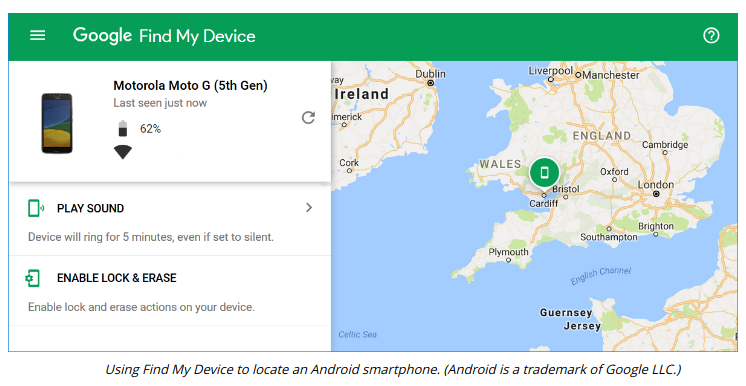
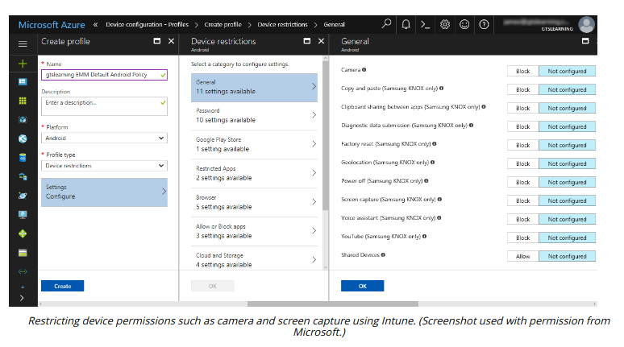

# LOCATION SERVICES

#### LOCATION SERVICES

Geolocation is the use of network attributes to identify (or estimate) the physical position of a device. The device uses location services to determine its current position. Location services can make use of two systems:

  
-   **Global Positioning System (GPS)**—a means of determining the device's latitude and longitude based on information received from satellites via a GPS sensor.
  
-   **Indoor Positioning System (IPS)**—works out a device's location by triangulating its proximity to other radio sources, such as cell towers, Wi-Fi access points, and Bluetooth/RFID beacons.
  

Location services is available to any app where the user has granted the app permission to use it.

The primary concern surrounding location services is one of privacy. Although very useful for maps and turn-by-turn navigation, it provides a mechanism to track an individual's movements, and therefore their social and business habits. The problem is further compounded by the plethora of mobile apps that require access to location services and then both send the information to the application developers and store it within the device's file structure. If an attacker can gain access to this data, then stalking, social engineering, and even identity theft become real possibilities.

**Geofencing and Camera/Microphone Enforcement**  
**Geofencing** is the practice of creating a virtual boundary based on real-world geography. Geofencing can be a useful tool with respect to controlling the use of camera or video functions or applying context-aware authentication. An organization may use geofencing to create a perimeter around its office property, and subsequently, limit the functionality of any devices that exceed this boundary. An unlocked smartphone could be locked and forced to reauthenticate when entering the premises, and the camera and microphone could be disabled. The device's position is obtained from location services.

**GPS Tagging**  
GPS tagging is the process of adding geographical identification metadata, such as the latitude and longitude where the device was located at the time, to media such as photographs, SMS messages, video, and so on. It allows the app to place the media at specific latitude and longitude coordinates. GPS tagging is highly sensitive personal information and potentially confidential organizational data also. GPS tagged pictures uploaded to social media could be used to track a person's movements and location. For example, a Russian soldier revealed troop positions by uploading GPS tagged selfies to Instagram [arstechnica.com](arstechnica.com/tech-policy/2014/08/opposite-of-opsec-russian-soldier-posts-selfies-from-inside-ukraine).
