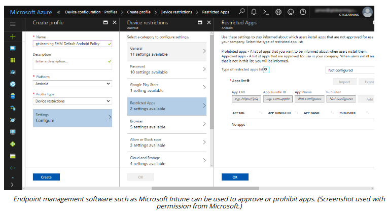

# APPLICATION MANAGEMENT

#### APPLICATION MANAGEMENT

When a device is joined to the corporate network through enrollment with management software, it can be configured into an enterprise workspace mode in which only a certain number of authorized applications can run.

A trusted app source is one that is managed by a service provider. The service provider authenticates and authorizes valid developers, issuing them with a certificate to use to sign their apps and warrant them as trusted. It may also analyze code submitted to ensure that it does not pose a security or privacy risk to its customers (or remove apps that are discovered to pose such a risk). It may apply other policies that developers must meet, such as not allowing apps with adult content or apps that duplicate the function of core OS apps.

The mobile OS defaults to restricting app installations to the linked store (App Store for iOS and Play for Android). Most consumers are happy with this model but it does not work so well for enterprises. It might not be appropriate to deliver a custom corporate app via a public store, where anyone could download it. Apple operates enterprise developer and distribution programs to solve this problem, allowing private app distribution via Apple Business Manager (developer.apple.com/business/distribute). Google's Play store has a private channel option, called Managed Google Play. Both these options allow an EMM/UEM suite to push apps from the private channel to the device.

Unlike iOS, Android allows for selection of different stores and installation of untrusted apps from any third party, if this option is enabled by the user. With unknown sources enabled, untrusted apps can be downloaded from a website and installed using the .apk file format. This is referred to as **sideloading**.

Conversely, a management suite might be used to prevent the use of third-party stores or sideloading and block unapproved app sources.