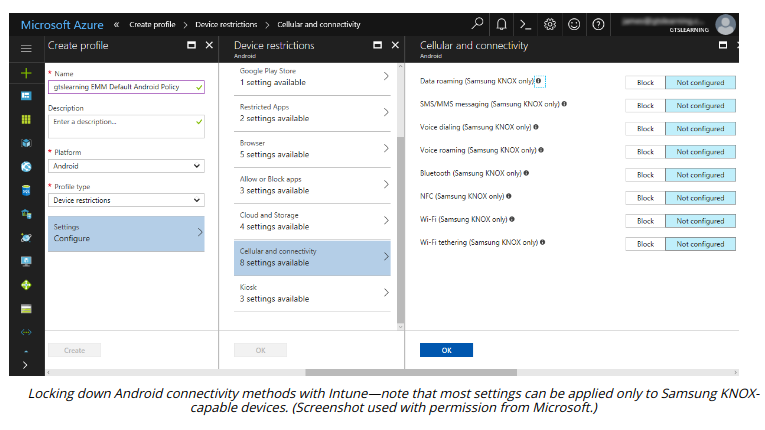

# CELLULAR AND GPS CONNECTION METHODS

#### CELLULAR AND GPS CONNECTION METHODS

Mobile devices use a variety of connection methods to establish communications in local and personal area networks and for Internet data access via service providers.

**Cellular Data Connections**  
Smartphones and some tablets use the cell phone network for calls and data access. A cellular data connection is less likely to be subject to monitoring and filtering. It may be appropriate to disable it when a device has access to an enterprise network or data, to prevent its use for data exfiltration.

There have been attacks and successful exploits against the major infrastructure and protocols underpinning the telecoms network, notably the SS7 hack (theregister.com/2017/05/03/hackers\_fire\_up\_ss7\_flaw). There is little that either companies or individuals can do about these weaknesses. The attacks require a high degree of sophistication and are relatively uncommon.

**Global Positioning System (GPS)**  
A **global positioning system (GPS)** sensor triangulates the device position using signals from orbital GPS satellites. As this triangulation process can be slow, most smartphones use Assisted GPS (A-GPS) to obtain coordinates from the nearest cell tower and adjust for the device's position relative to the tower. A-GPS uses cellular data. GPS satellites are operated by the US Government. Some GPS sensors can use signals from other satellites, operated by the EU (Galileo), Russia (GLONASS), or China (BeiDou).

GPS signals can be jammed or even spoofed using specialist radio equipment. This might be used to defeat geofencing mechanisms, for instance (kaspersky.com/blog/gps-spoofing-protection/26837).