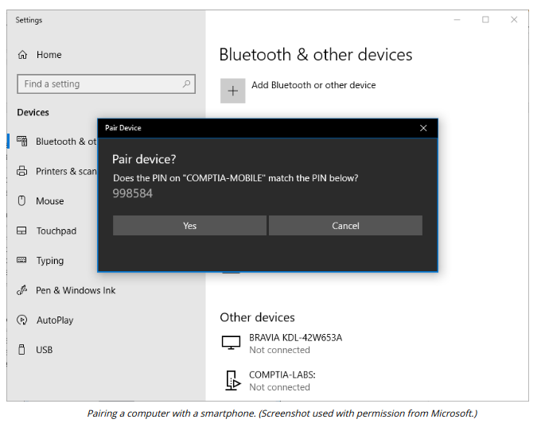

# BLUETOOTH CONNECTION METHODS

#### BLUETOOTH CONNECTION METHODS

Bluetooth is one of the most popular technologies for implementing Personal Area Networks (PANs). While native Bluetooth has fairly low data rates, it can be used to pair with another device and then use a Wi-Fi link for data transfer. This sort of connectivity is implemented by iOS's AirDrop feature.

Bluetooth devices have a few known security issues:

  
-   Device discovery—a device can be put into discoverable mode meaning that it will connect to any other Bluetooth devices nearby. Unfortunately, even a device in non-discoverable mode is quite easy to detect.
  
-   Authentication and authorization—devices authenticate ("pair") using a simple passkey configured on both devices. This should always be changed to some secure phrase and never left as the default. Also, check the device's pairing list regularly to confirm that the devices listed are valid.
  
-   Malware—there are proof-of-concept Bluetooth worms and application exploits, most notably the BlueBorne exploit (armis.com/blueborne), which can compromise any active and unpatched system regardless of whether discovery is enabled and without requiring any user intervention. There are also vulnerabilities in the authentication schemes of many devices. Keep devices updated with the latest firmware.

> _It is also the case that using a control center toggle may not actually turn off the Bluetooth radio on a mobile device. If there is any doubt about patch status or exposure to vulnerabilities, Bluetooth should be fully disabled through device settings._

Unless some sort of authentication is configured, a discoverable device is vulnerable to **bluejacking**, a sort of spam where someone sends you an unsolicited text (or picture/video) message or vCard (contact details). This can also be a vector for malware, as demonstrated by the Obad Android Trojan malware (securelist.com/the-most-sophisticated-android-trojan/35929).

**Bluesnarfing** refers to using an exploit in Bluetooth to steal information from someone else's phone. The exploit (now patched) allows attackers to circumvent the authentication mechanism. Even without an exploit, a short (4 digit) PIN code is vulnerable to brute force password guessing.

Other significant risks come from the device being connected to. A peripheral device with malicious firmware can be used to launch highly effective attacks. This type of risk has a low likelihood, as the resources required to craft such malicious peripherals are demanding.