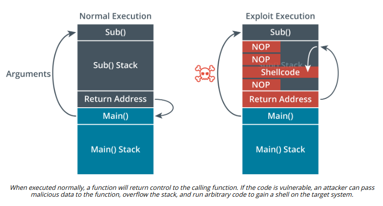

# OVERFLOW VULNERABILITIES

#### OVERFLOW VULNERABILITIES

In an overflow attack, the threat actor submits input that is too large to be stored in a variable assigned by the application. Some of the general overflow vulnerabilities are discussed here. To keep up to date with specific attack methods and new types of attack, monitor a site such as OWASP (owasp.org/www-community/attacks). Ideally, the code used to attempt these attacks will be identified by network IDS or by an endpoint protection agent. Unsuccessful attempts may be revealed through unexplained crashes or error messages following a file download, execution of a new app or a script, or connection of new hardware.

**Buffer Overflow**  
A buffer is an area of memory that the application reserves to store expected data. To exploit a **buffer overflow** vulnerability, the attacker passes data that deliberately overfills the buffer. One of the most common vulnerabilities is a stack overflow. The stack is an area of memory used by a program subroutine. It includes a return address, which is the location of the program that called the subroutine. An attacker could use a buffer overflow to change the return address, allowing the attacker to run arbitrary code on the system.

**Integer Overflow**  
An integer is a positive or negative number with no fractional component (a whole number). Integers are widely used as a data type, where they are commonly defined with fixed lower and upper bounds. An **integer overflow** attack causes the target software to calculate a value that exceeds these bounds. This may cause a positive number to become negative (changing a bank debit to a credit, for instance). It could also be used where the software is calculating a buffer size; if the attacker is able to make the buffer smaller than it should be, he or she may then be able to launch a buffer overflow attack.

> _EternalBlue is an example of an exploit that uses vulnerabilities in integer overflow to effect a buffer overflow and gain system privileges on a Windows host (sentinelone.com/blog/eternalblue-nsa-developed-exploit-just-wont-die)._