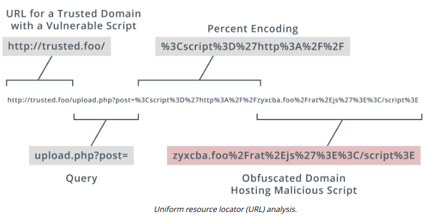

# UNIFORM RESOURCE LOCATOR ANALYSIS

#### UNIFORM RESOURCE LOCATOR ANALYSIS

As well as pointing to the host or service location on the Internet (by domain name or IP address), a **uniform resource locator (URL)** can encode some action or data to submit to the server host. This is a common vector for malicious activity.



**HTTP Methods**  
As part of URL analysis, it is important to understand how HTTP operates. An HTTP session starts with a client (a user-agent, such as a web browser) making a request to an HTTP server. The connection establishes a TCP connection. This TCP connection can be used for multiple requests, or a client can start new TCP connections for different requests. A request typically comprises a method, a resource (such as a URL path), version number, headers, and body. The principal method is GET, used to retrieve a resource. Other methods include:

  
-   POST—send data to the server for processing by the requested resource.
  
-   PUT—create or replace the resource. DELETE can be used to remove the resource.
  
-   HEAD—retrieve the headers for a resource only (not the body).
  

Data can be submitted to a server either by using a POST or PUT method and the HTTP headers and body, or by encoding the data within the URL used to access the resource. Data submitted via a URL is delimited by the ? character, which follows the resource path. Query parameters are usually formatted as one or more name=value pairs, with ampersands delimiting each pair. A URL can also include a fragment or anchor ID, delimited by #. The fragment is not processed by the web server. An anchor ID is intended to refer to a section of a page but can be misused to inject JavaScript.

The server response comprises the version number and a status code and message, plus optional headers, and message body. An HTTP response code is the header value returned by a server when a client requests a URL, such as 200 for "OK" or 404 for "Not Found."

**Percent Encoding**  
A URL can contain only unreserved and reserved characters from the ASCII set. Reserved ASCII characters are used as delimiters within the URL syntax and should only be used unencoded for those purposes. The reserved characters are:

```Markdown
: / ? # [ ] @ ! $ & ' ( ) * + , ; =
``` 

There are also unsafe characters, which cannot be used in a URL. Control characters, such as null string termination, carriage return, line feed, end of file, and tab, are unsafe. **Percent encoding** allows a user-agent to submit any safe or unsafe character (or binary data) to the server within the URL. Its legitimate uses are to encode reserved characters within the URL when they are not part of the URL syntax and to submit Unicode characters. Percent encoding can be misused to obfuscate the nature of a URL (encoding unreserved characters) and submit malicious input. Percent encoding can exploit weaknesses in the way the server application performs decoding. Consequently, URLs that make unexpected or extensive use of percent encoding should be treated carefully. You can use a resource such as W3 Schools (w3schools.com/tags/ref\_urlencode.asp) for a complete list of character codes, but it is helpful to know some of the characters most widely used in exploits.

Character | Percent Encoding
----- | -----
null | %00
space | %20
CR (Carriage Return) | %0D
LF (Line Feed) | %0A
\+ | %2B
\% | %25
\/ |%2F
\\ | %5C
. | %2E
? | %3F
" | %22
' | %27
< | %3C
\> | %3E
& | %26
\| | %7C