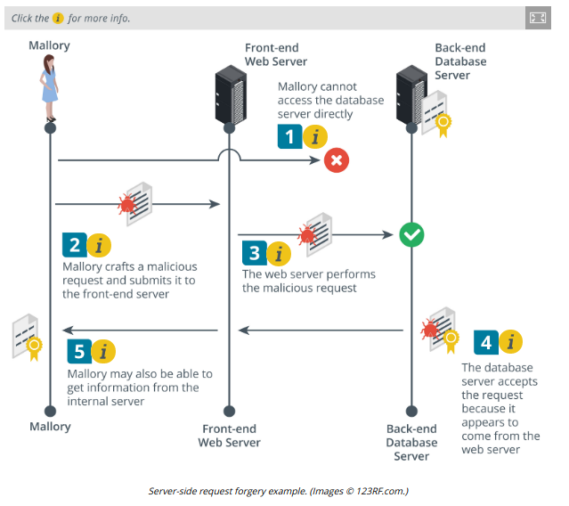

# SERVER-SIDE REQUEST FORGERY

#### SERVER-SIDE REQUEST FORGERY

A server-side request forgery (SSRF) causes the server application to process an arbitrary request that targets another service, either on the same host or a different one (owasp.org/www-community/attacks/Server\_Side\_Request\_Forgery). SSRF exploits both the lack of authentication between the internal servers and services (implicit trust) and weak input validation, allowing the attacker to submit unsanitized requests or API parameters.

A web application takes API input via a URL or as data encoded in HTTP response headers. The web application is likely to use a standard library to read (parse) the URL or response headers. Many SSRF attacks depend on exploits against specific parsing mechanisms in standard libraries for web servers, such as Apache or IIS, and web application programming languages and tools, such as the curl library, Java, and PHP. SSRF can also use XML injection to exploit weaknesses in XML document parsing.

One type of SSRF uses HTTP request splitting or CRLF injection. The attacker crafts a malicious URL or request header targeting the server's API. The request contains extra line feeds, which may be coded in some non-obvious way. Unless the web server strips these out when processing the URL, it will be tricked into performing a second HTTP request.

SSRF attacks are often targeted against cloud infrastructure where the web server is only the public-facing component of a deeper processing chain. A typical web application comprises multiple layers of servers, with a client interface, middleware logic layers, and a database layer. Requests initiated from the client interface (a web form) are likely to require multiple requests and responses between the middleware and back-end servers. These will be implemented as HTTP header requests and responses between each server's API. SSRF is a means of accessing these internal servers by causing the public server to execute requests on them. While with CSRF an exploit only has the privileges of the client, with SSRF the manipulated request is made with the server's privilege level.

SSRF encompasses a very wide range of potential exploits and targets, some of which include:

  
-   Reconnaissance—a response may contain metadata describing the type and configuration of internal servers. SSRF can also be used to port scan within the internal network.
  
-   Credential stealing—a response may contain an API key that the internal servers use between themselves.
  
-   Unauthorized requests—the server-initiated request might change data or access a service in an unauthorized way.
  
-   Protocol smuggling—despite initially being carried over HTTP, the SSRF might target an internal SMTP or FTP server. That server may be configured in a "best effort" way, strip the HTTP header, and do its best to return the response to the SMTP or FTP request.