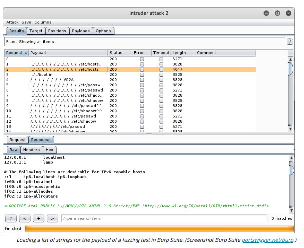

# STATIC CODE ANALYSIS

#### STATIC CODE ANALYSIS

Development is only one stage in the software life cycle. A new release of an application or automation script should be audited to ensure that it meets the goals of confidentiality, integrity, and availability critical to any secure computer system.

**Static code analysis** (or source code analysis) is performed against the application code before it is packaged as an executable process. The analysis software must support the programming language used by the source code. The software will scan the source code for signatures of known issues, such as OWASP Top 10 Most Critical Web Application Security Risks or injection vulnerabilities generally. NIST maintains a list of source code analyzers and their key features (samate.nist.gov/index.php/Source\_Code\_Security\_Analyzers.html).

Human analysis of software source code is described as a manual **code review**. It is important that the code be reviewed by developers (peers) other than the original coders to try to identify oversights, mistaken assumptions, or a lack of knowledge or experience. It is important to establish a collaborative environment in which reviews can take place effectively.

**DYNAMIC CODE ANALYSIS**  

Static code review techniques will not reveal vulnerabilities that might exist in the runtime environment, such as exposure to race conditions or unexpected user input. Dynamic analysis means that the application is tested under "real world" conditions using a staging environment.

**Fuzzing** is a means of testing that an application's input validation routines work well. Fuzzing means that the test or vulnerability scanner generates large amounts of deliberately invalid and/or random input and records the responses made by the application. This is a form of "**stress testing**" that can reveal how robust the application is. There are generally three types of fuzzers, representing different ways of injecting manipulated input into the application:

  
-   Application UI—identify input streams accepted by the application, such as input boxes, command line switches, or import/export functions.
  
-   Protocol—transmit manipulated packets to the application, perhaps using unexpected values in the headers or payload.
  
-   File format—attempt to open files whose format has been manipulated, perhaps manipulating specific features of the file.
  

Fuzzers are also distinguished by the way in which they craft each input (or test case). The fuzzer may use semi-random input (dumb fuzzer) or might craft specific input based around known exploit vectors, such as escaped command sequences or character literals, or by mutating intercepted inputs.

Associated with fuzzing is the concept of stress testing an application to see how an application performs under extreme performance or usage scenarios.

Finally, the fuzzer needs some means of detecting an application crash and recording which input sequence generated the crash.

