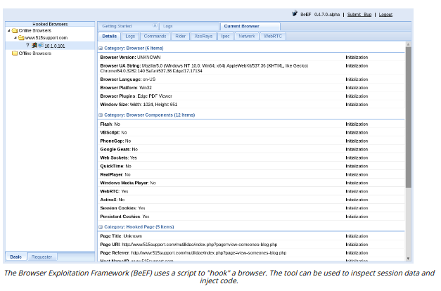

# MAN-IN-THE-BROWSER ATTACK

#### MAN-IN-THE-BROWSER ATTACK

A **man-in-the-browser (MitB)** attack is a specific type of on-path attack where the web browser is compromised. Depending on the level of privilege obtained, the attacker may be able to inspect session cookies, certificates, and data, change browser settings, perform redirection, and inject code.

A MitB attack may be accomplished by installing malicious plug-ins or scripts or intercepting calls between the browser process and DLLs (attack.mitre.org/techniques/T1185). The Browser Exploitation Framework (BeEF) (beefproject.com) is one well known MitB tool. There are various vulnerability exploit kits that can be installed to a website to actively try to exploit vulnerabilities in clients browsing the site (trendmicro.com/vinfo/ie/security/definition/exploit-kit). These kits may either be installed to a legitimate site without the owner's knowledge (by compromising access control on the web server) and load in an iFrame (invisible to the user), or the attacker may use phishing/social engineering techniques to trick users into visiting the site.

