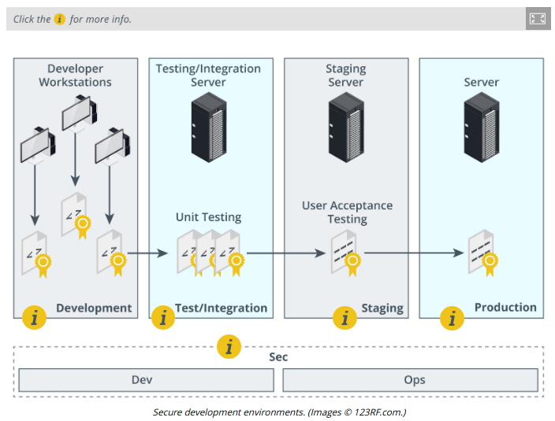

# SECURE APPLICATION DEVELOPMENT ENVIRONMENTS

#### SECURE APPLICATION DEVELOPMENT ENVIRONMENTS

Security must be a key component of the application or automation design process. Even a simple form and script combination can make a web server vulnerable if the script is not well written. A **software development life cycle (SDLC)** divides the creation and maintenance of software into discrete phases. There are two principal SDLCs: the **waterfall model** and **Agile development**. Both these models stress the importance of requirements analysis and quality processes to the success of development projects.

**Quality Assurance (QA)**  
Quality processes are how an organization tests a system to identify whether it complies with a set of requirements and expectations. These requirements and expectations can be driven by risk-based assessments, or they can be driven by internal and external compliance factors, such as industry regulations and company-defined quality standards. Quality control (QC) is the process of determining whether a system is free from defects or deficiencies. QC procedures are themselves defined by a **quality assurance (QA)** process, which analyzes what constitutes "quality" and how it can be measured and checked.

**Development Environments**  
To meet the demands of the life cycle model and quality assurance, code is normally passed through several different environments:

  
-   Development—the code will be hosted on a secure server. Each developer will check out a portion of code for editing on his or her local machine. The local machine will normally be configured with a sandbox for local testing. This ensures that whatever other processes are being run locally do not interfere with or compromise the application being developed.
  
-   Test/integration—in this environment, code from multiple developers is merged to a single master copy and subjected to basic unit and functional tests (either automated or by human testers). These tests aim to ensure that the code builds correctly and fulfills the functions required by the design.
  
-   **Staging**—this is a mirror of the production environment but may use test or sample data and will have additional access controls so that it is only accessible to test users. Testing at this stage will focus more on usability and performance.
  
-   Production—the application is released to end users.

