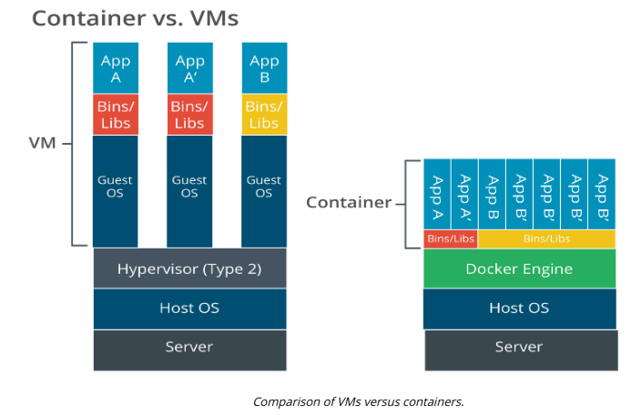

# APPLICATION VIRTUALIZATION AND CONTAINER VIRTUALIZATION

#### APPLICATION VIRTUALIZATION AND CONTAINER VIRTUALIZATION

Application virtualization is a more limited type of VDI. Rather than run the whole client desktop as a virtual platform, the client either accesses an application hosted on a server or streams the application from the server to the client for local processing. Most application virtualization solutions are based on Citrix XenApp (formerly MetaFrame/Presentation Server), though Microsoft has developed an App-V product with its Windows Server range and VMware has the ThinApp product. These solution types are now often used with HTML5 remote desktop apps, referred to as "clientless" because users can access them through ordinary web browser software.

Application cell/container virtualization dispenses with the idea of a hypervisor and instead enforces resource separation at the operating system level. The OS defines isolated "cells" for each user instance to run in. Each cell or container is allocated CPU and memory resources, but the processes all run through the native OS kernel. These containers may run slightly different OS distributions but cannot run guest OSes of different types (you could not run Windows or Ubuntu in a RedHat Linux container, for instance). Alternatively, the containers might run separate application processes, in which case the variables and libraries required by the application process are added to the container.

One of the best-known container virtualization products is Docker (docker.com). Containerization underpins many cloud services. In particular it supports microservices and serverless architecture. Containerization is also being widely used to implement corporate workspaces on mobile devices.

