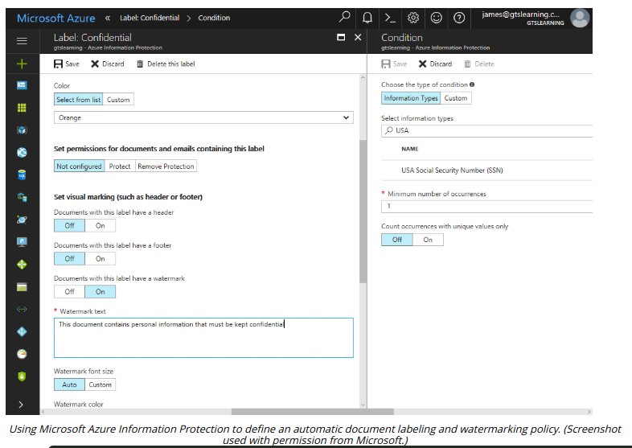

# DATA CLASSIFICATIONS

#### DATA CLASSIFICATIONS

**Data classification** and typing schemas tag data assets so that they can be managed through the information life cycle. A data classification schema is a decision tree for applying one or more tags or labels to each data asset. Many data classification schemas are based on the degree of confidentiality required:

-   Public (unclassified)—there are no restrictions on viewing the data. Public information presents no risk to an organization if it is disclosed but does present a risk if it is modified or not available.
  
-   Confidential (secret)—the information is highly sensitive, for viewing only by approved persons within the owner organization, and possibly by trusted third parties under NDA.
  
-   Critical (top secret)—the information is too valuable to allow any risk of its capture. Viewing is severely restricted.
  

Another type of classification schema identifies the kind of information asset:

-   Proprietary—**proprietary information** or **intellectual property (IP)** is information created and owned by the company, typically about the products or services that they make or perform. IP is an obvious target for a company's competitors, and IP in some industries (such as defense or energy) is of interest to foreign governments. IP may also represent a counterfeiting opportunity (movies, music, and books, for instance).
  
-   Private/personal data—information that relates to an individual identity.
  
-   Sensitive—this label is usually used in the context of personal data. Privacy-sensitive information about a person could harm them if made public and could prejudice decisions made about them if referred to by internal procedures. As defined by the EU's General Data Protection Regulations (GDPR), sensitive personal data includes religious beliefs, political opinions, trade union membership, gender, sexual orientation, racial or ethnic origin, genetic data, and health information (ec.europa.eu/info/law/law-topic/data-protection/reform/rules-business-and-organisations/legal-grounds-processing-data/sensitive-data/what-personal-data-considered-sensitive\_en).