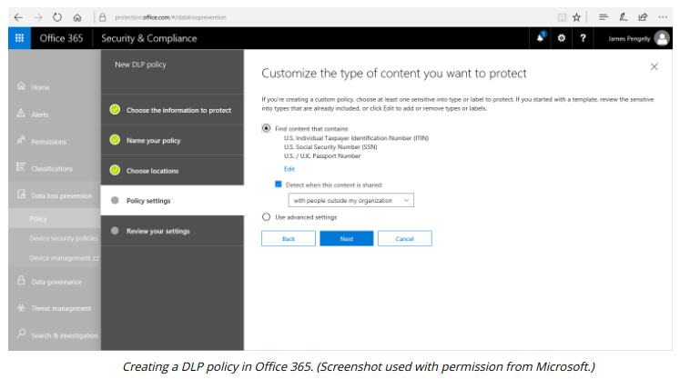

# DATA LOSS PREVENTION

#### DATA LOSS PREVENTION

To apply data guardianship policies and procedures, smaller organizations might classify and type data manually. An organization that creates and collects large amounts of personal data will usually need to use automated tools to assist with this task, however. There may also be a requirement to protect valuable intellectual property (IP) data. **Data loss prevention (DLP)** products automate the discovery and classification of data types and enforce rules so that data is not viewed or transferred without a proper authorization. Such solutions will usually consist of the following components:

  
-   Policy server—to configure classification, confidentiality, and privacy rules and policies, log incidents, and compile reports.
  
-   Endpoint agents—to enforce policy on client computers, even when they are not connected to the network.
  
-   Network agents—to scan communications at network borders and interface with web and messaging servers to enforce policy.
  

DLP agents scan content in structured formats, such as a database with a formal access control model or unstructured formats, such as email or word processing documents. A file cracking process is applied to unstructured data to render it in a consistent scannable format. The transfer of content to removable media, such as USB devices, or by email, instant messaging, or even social media, can then be blocked if it does not conform to a predefined policy. Most DLP solutions can extend the protection mechanisms to cloud storage services, using either a proxy to mediate access or the cloud service provider's API to perform scanning and policy enforcement.

Remediation is the action the DLP software takes when it detects a policy violation. The following remediation mechanisms are typical:

  
-   Alert only—the copying is allowed, but the management system records an incident and may alert an administrator.
  
-   Block—the user is prevented from copying the original file but retains access to it. The user may or may not be alerted to the policy violation, but it will be logged as an incident by the management engine.
  
-   Quarantine—access to the original file is denied to the user (or possibly any user). This might be accomplished by encrypting the file in place or by moving it to a quarantine area in the file system.
  
-   Tombstone—the original file is quarantined and replaced with one describing the policy violation and how the user can release it again.
  

When it is configured to protect a communications channel such as email, DLP remediation might take place using client-side or server-side mechanisms. For example, some DLP solutions prevent the actual attaching of files to the email before it is sent. Others might scan the email attachments and message contents, and then strip out certain data or stop the email from reaching its destination.

Some of the leading vendors include McAfee (skyhighnetworks.com/cloud-data-loss-prevention), Symantec/Broadcom (broadcom.com/products/cyber-security/information-protection/data-loss-prevention), and Digital Guardian (digitalguardian.com). A DLP and compliance solution is also available with Microsoft's Office 365 suite (docs.microsoft.com/en-us/microsoft-365/compliance/data-loss-prevention-policies?view=o365-worldwide).