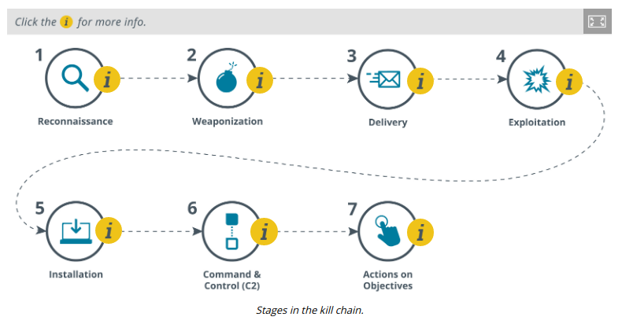

# CYBER KILL CHAIN ATTACK FRAMEWORK

#### CYBER KILL CHAIN ATTACK FRAMEWORK

Effective incident response depends on threat intelligence. Threat research provides insight into adversary tactics, techniques, and procedures (TTPs). Insights from threat research can be used to develop specific tools and playbooks to deal with event scenarios. A key tool for threat research is a framework to use to describe the stages of an attack. These stages are often referred to as a cyber **kill chain**, following the influential white paper Intelligence-Driven Computer Network Defense commissioned by Lockheed Martin (lockheedmartin.com/content/dam/lockheed-martin/rms/documents/cyber/LM-White-Paper-Intel-Driven-Defense.pdf).

The Lockheed Martin kill chain identifies the following phases:

1.  Reconnaissance—in this stage the attacker determines what methods to use to complete the phases of the attack and gathers information about the target's personnel, computer systems, and supply chain.
  
2.  Weaponization—the attacker couples payload code that will enable access with exploit code that will use a vulnerability to execute on the target system.
  
3.  Delivery—the attacker identifies a vector by which to transmit the weaponized code to the target environment, such as via an email attachment or on a USB drive.
  
4.  Exploitation—the weaponized code is executed on the target system by this mechanism. For example, a phishing email may trick the user into running the code, while a drive-by-download would execute on a vulnerable system without user intervention.
  
5.  Installation—this mechanism enables the weaponized code to run a remote access tool and achieve persistence on the target system.
  
6.  Command and control (C2 or C&C)—the weaponized code establishes an outbound channel to a remote server that can then be used to control the remote access tool and possibly download additional tools to progress the attack.
  
7.  Actions on objectives—in this phase, the attacker typically uses the access he has achieved to covertly collect information from target systems and transfer it to a remote system (data exfiltration). An attacker may have other goals or motives, however.