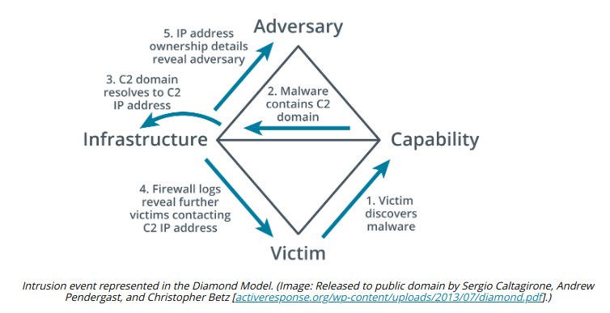

# OTHER ATTACK FRAMEWORKS

#### OTHER ATTACK FRAMEWORKS

Other types of **attack framework** have been implemented to provide a means of categorizing features of adversary behaviors to make it easier to identify indicators of such attacks.

**MITRE ATT&CK**  
As an alternative to the life cycle analysis implied by a kill chain, the **MITRE Corporation's Adversarial Tactics, Techniques, and Common Knowledge (ATT&CK)** matrices provide access to a database of known TTPs. This freely available resource (attack.mitre.org) tags each technique with a unique ID and places it in one or more tactic categories, such as initial access, persistence, lateral movement, or command and control. The sequence in which attackers may deploy any given tactic category is not made explicit. This means analysts must interpret each attack life cycle from local evidence. The framework makes TTPs used by different adversary groups directly comparable, without assuming how any particular adversary will run a campaign at a strategic level.

There is a matrix for enterprise, which can also be viewed as TTPs directed against Linux, macOS, and Windows hosts, and a second matrix for mobile. For example, Drive by Compromise is given the ID T1189 and categorized as an Initial Access tactic that can target Windows, Linux, and macOS hosts. Clicking through to the page accesses information about detection methods, mitigation methods, and examples of historic uses and analysis.

**The Diamond Model of Intrusion Analysis**  
The **Diamond Model** of Intrusion Analysis suggests a framework to analyze an intrusion event (E) by exploring the relationships between four core features: adversary, capability, infrastructure, and victim. These four features are represented by the four vertices of a diamond shape. Each event may also be described by meta-features, such as date/time, kill chain phase, result, and so on. Each feature is also assigned a confidence level (C), indicating data accuracy or the reliability of a conclusion or assumption assigned to the value by analysis.

- 