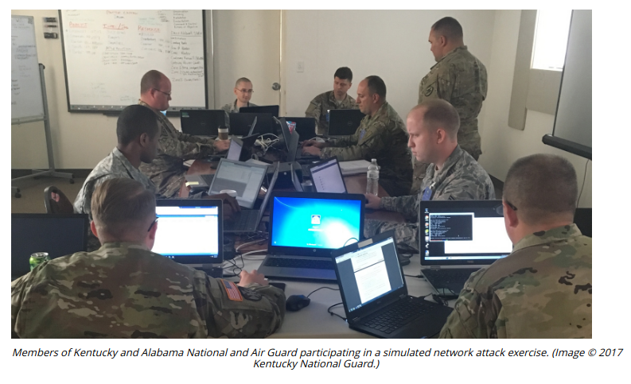

# INCIDENT RESPONSE EXERCISES

#### INCIDENT RESPONSE EXERCISES

The procedures and tools used for incident response are difficult to master and execute effectively. You do not want to be in the situation where first-time staff members are practicing them in the high-pressure environment of an actual incident. Running test exercises helps staff develop competencies and can help to identify deficiencies in the procedures and tools. Training on specific incident response scenarios can use three forms:

-   Tabletop—this is the least costly type of training. The facilitator presents a scenario and the responders explain what action they would take to identify, contain, and eradicate the threat. The training does not use computer systems. The scenario data is presented as flashcards.
  
-   Walkthroughs—in this model, a facilitator presents the scenario as for a tabletop exercise, but the incident responders demonstrate what actions they would take in response. Unlike a tabletop exercise, the responders perform actions such as running scans and analyzing sample files, typically on sandboxed versions of the company's actual response and recovery tools.
  
-   Simulations—a simulation is a team-based exercise, where the red team attempts an intrusion, the blue team operates response and recovery controls, and a white team moderates and evaluates the exercise. This type of training requires considerable investment and planning.
  

> _MITRE have published a white paper that discusses preparing and facilitating incident response exercises (mitre.org/sites/default/files/publications/pr\_14-3929-cyber-exercise-playbook.pdf</font)._