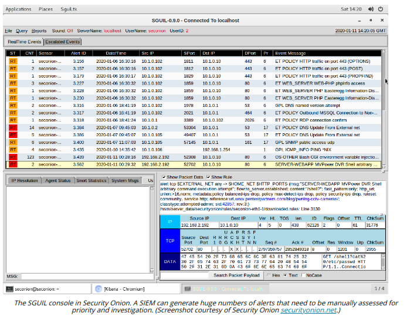

# SIEM DASHBOARDS

#### SIEM DASHBOARDS

SIEM dashboards are one of the main sources of automated alerts. A SIEM dashboard provides a console to work from for day-to-day incident response. Separate dashboards can be created to suit many different purposes. An incident handler's dashboard will contain uncategorized events that have been assigned to their account, plus visualizations (graphs and tables) showing key status metrics. A manager's dashboard would show overall status indicators, such as number of unclassified events for all event handlers.

**Sensitivity and Alerts**  
One of the greatest challenges in operating a SIEM is tuning the system sensitivity to reduce false positive indicators being reported as an event. This is difficult firstly because there isn't a simple dial to turn for overall sensitivity, and secondly because reducing the number of rules that produce events increases the risk of false negatives. A false negative is where indicators that should be correlated as an event and raise an alert are ignored.

The correlation rules are likely to assign a criticality level to each match. For example:

-   Log only—an event is produced and added to the SIEM's database, but it is automatically classified.
  
-   Alert—the event is listed on a dashboard or incident handling system for an agent to assess. The agent classifies the event and either dismisses it to the log or escalates it as an incident.
  
-   Alarm—the event is automatically classified as critical and a priority alarm is raised. This might mean emailing an incident handler or sending a text message.
  

**Sensors**  
A sensor is a network tap or port mirror that performs packet capture and intrusion detection. One of the key uses of a SIEM is to aggregate data from multiple sensors and log sources, but it might also be appropriate to configure dashboards that show output from a single sensor or source host.