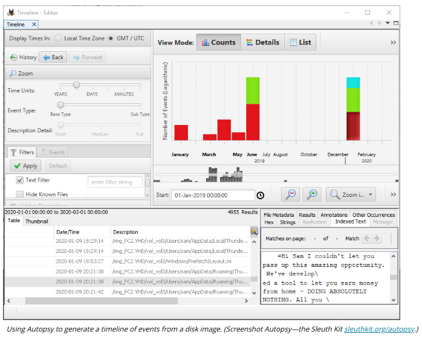

# TIMELINES

#### TIMELINES

A significant part of a forensic investigation will involve tying events to specific times to establish a consistent and verifiable narrative. The visual representation of events happening in chronological order is called a timeline.

Operating systems and file systems use a variety of methods to identify the time at which something occurred. The benchmark time is Coordinated Universal Time (UTC), which is essentially the time at the Greenwich meridian. Local time is the time within a particular time zone, which will be offset from UTC by several hours (or in some cases, half hours). The local **time offset** may also vary if a seasonal daylight saving time is in place.

NTFS uses UTC "internally" but many OS and file systems record time stamps as the local system time. When collecting evidence, it is vital to establish how a time stamp is calculated and note the offset between the local system time and UTC.

Forensics also needs to consider that a host's system clock may not be properly synchronized to a valid time source or may have been tampered with. Most computers are configured to synchronize the clock to a Network Time Protocol (NTP) server. Closely synchronized time is important for authentication and audit systems to work properly. The right to modify a computer's time would normally be restricted to administrator-level accounts (on enterprise networks) and time change events should be logged.

