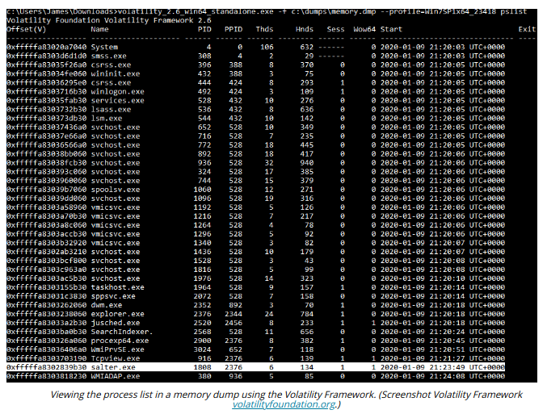

# SYSTEM MEMORY ACQUISITION

#### SYSTEM MEMORY ACQUISITION

System memory is volatile data held in Random Access Memory (RAM) modules. Volatile means that the data is lost when power is removed. A system memory dump creates an image file that can be analyzed to identify the processes that are running, the contents of temporary file systems, registry data, network connections, cryptographic keys, and more. It can also be a means of accessing data that is encrypted when stored on a mass storage device. There are various methods of collecting the contents of system memory.

**Live Acquisition**  
A specialist hardware or software tool can capture the contents of memory while the host is running. Unfortunately, this type of tool needs to be preinstalled as it requires a kernel mode driver to dump any data of interest. Some examples for Windows include WinHex (x-ways.net/winhex), Memoryze from FireEye (fireeye.com/services/freeware/memoryze.html), and F-Response TACTICAL (f-response.com/software/tac).

On Linux, a user mode tool, such as **memdump** (porcupine.org/forensics/tct.html) or dd, can be run against the `/dev/mem` device file. However, on most modern distributions, access to this file is blocked. The Volatility Framework (github.com/volatilityfoundation/volatility) includes a tool to install a kernel driver (pmem). The fmem and LiME kernel utilities provide similar functionality.

**Crash Dump**  
When Windows encounters an unrecoverable kernel error, it can write contents of memory to a dump file at `C:\Windows\MEMORY.DMP`. On modern systems, there is unlikely to be a complete dump of all the contents of memory, as these could take up a lot of disk space. However, even mini dump files, stored in `C:\Windows\Minidumps`, may be a valuable source of information.

**Hibernation File and Pagefile**  
A hibernation file is created on disk in the root folder of the boot volume when a Windows host is put into a sleep state. If it can be recovered, the data can be decompressed and loaded into a software tool for analysis. The drawback is that network connections will have been closed, and malware may have detected the use of a sleep state and performed **anti-forensics**.

The `pagefile/swap` `file/swap` partition stores pages of memory in use that exceed the capacity of the host's RAM modules. The pagefile is not structured in a way that analysis tools can interpret, but it is possible to search for strings.