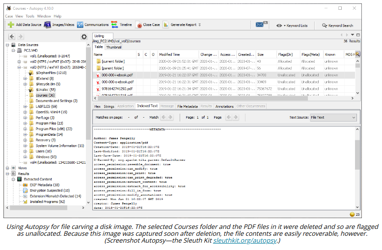

# ACQUISITION OF OTHER DATA

#### ACQUISITION OF OTHER DATA

There are other potential sources of forensic data within computer systems and networks, though they can be hard to acquire or to prove as admissible.

**Network**  
Packet captures and traffic flows can contain very valuable evidence, if the capture was running at the right time and in the right place to record the incident. As with memory forensics, the issue for forensics lies in establishing the integrity of the data. Most network data will come from a SIEM.

**Cache**  
Cache can refer either to hardware components or software. Software-based cache is stored in the file system and can be acquired as part of a disk image. For example, each brower has a cache of temporary files, and each user profile has a cache of temp files. Some cache artifacts generated by the OS and applications are held in memory only, such as portions of the registry, cryptographic keys, password hashes, some types of cookies, and so on. The contents of hardware cache (CPU registers and disk controller read/write cache, for instance) is not generally recoverable.

**Artifacts and Data Recovery**  
Artifacts refers to any type of data that is not part of the mainstream data structures of an operating system. For example, the Windows **Alternate Data Streams (ADS)** feature is often used to conceal file data, and various caches, such as prefetch and Amcache, can be used to find indicators of suspicious process behavior.

Data recovery refers to analyzing a disk (or image of a disk) for file fragments stored in slack space. These fragments might represent deleted or overwritten files. The process of recovering them is referred to as **carving**.

**Snapshot**  
A snapshot is a live acquisition image of a persistent disk. While this may have less validity than an image taken from a device using a write blocker, it may be the only means of acquiring data from a virtual machine or cloud process.

**Firmware**  
Firmware is usually implemented as flash memory. Some types, such as the PC firmware, can potentially be extracted from the device or from system memory using an imaging utility. It likely will be necessary to use specialist hardware to attach the device to a forensic workstation, however.