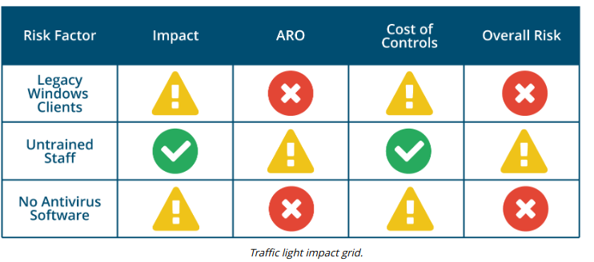

# QUALITATIVE RISK ASSESSMENT

#### QUALITATIVE RISK ASSESSMENT

Qualitative risk assessment avoids the complexity of the quantitative approach and is focused on identifying significant risk factors. The qualitative approach seeks out people's opinions of which risk factors are significant. Assets and risks may be placed in simple categories. For example, assets could be categorized as Irreplaceable, High Value, Medium Value, and Low Value; risks could be categorized as one-off or recurring and as Critical, High, Medium, and Low probability.

Another simple approach is the heat map or "Traffic Light" impact matrix. For each risk, a simple Red, Yellow, or Green indicator can be put into each column to represent the severity of the risk, its likelihood, cost of controls, and so on. This approach is simplistic but does give an immediate impression of where efforts should be concentrated to improve security.

FIPS 199 (nvlpubs.nist.gov/nistpubs/FIPS/NIST.FIPS.199.pdf) discusses how to apply security categorizations (SC) to information systems based on the impact that a breach of confidentiality, integrity, or availability would have on the organization as a whole. Potential impacts can be classified as:

-   Low—minor damage or loss to an asset or loss of performance (though essential functions remain operational).
-   Moderate—significant damage or loss to assets or performance.
-   High—major damage or loss or the inability to perform one or more essential functions.