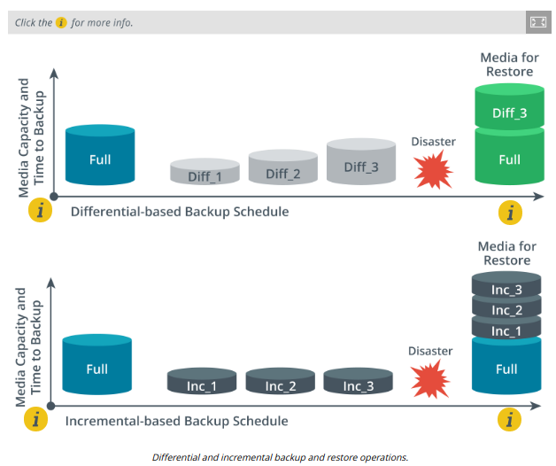

# BACKUP TYPES

#### BACKUP TYPES

Utilities that support enterprise backup operations come with features to support retention policies and media rotation. When considering a backup made against an original copy of data, the backup can usually be performed using one of three main types: full, incremental, and differential. In Windows, a **full backup** includes all selected files and directories while incremental and differential backups check the status of the archive attribute before including a file. The archive attribute is set whenever a file is modified. This allows backup software to determine which files have been changed and therefore need to be copied.

> _Linux doesn't support a file archive attribute. Instead, a date stamp is used to determine whether the file has changed._

**Full, Incremental, and Differential Backup Types**  
The following table summarizes the three different backup types.

Type | Data Selection | Backup/Restore Time | Archive Attribute
------ | ------ | ------ | ------
Full | All selected data regardless of when it was previously backed up | High/low (one tape set) | Cleared
Incremental | New files, as well as files modified since the last backup | Low/high (multiple tape sets) | Cleared
Differential | All new and modified files since the last full backup | Moderate/moderate (no more than two sets) | Not Cleared

  

The factors that determine which method to use are the time it takes to restore versus the time it takes to back up. Assuming a backup is performed every working day, an **incremental backup** only includes files changed during that day, while a **differential backup** includes all files changed since the last full backup. Incremental backups save backup time but can be more time-consuming when the system must be restored. The system must be restored from the last full backup set and then from each incremental backup that has subsequently occurred. A differential backup system only involves two tape sets when restoration is required.

> _Do not combine differential and incremental backups. Use full backups interspersed with differential backups or full backups interspersed with incremental backups._

**Copy Backups**  
Most software also has the capability to do copy backups. These are made outside the tape rotation system and do not affect the archive attribute.