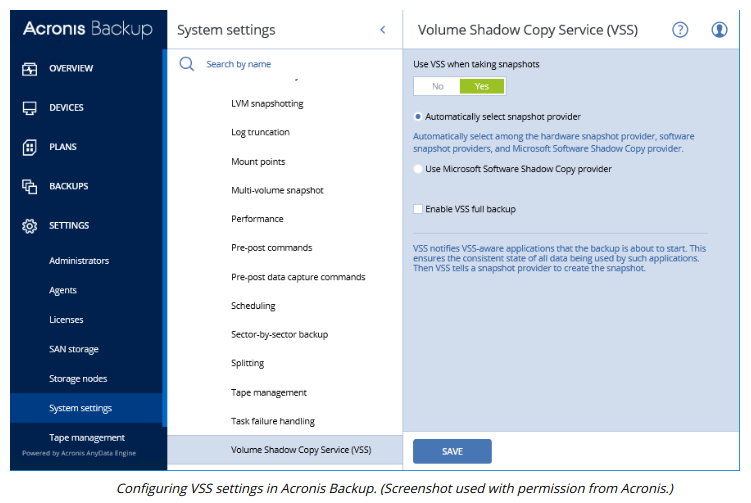

# SNAPSHOTS AND IMAGES

#### SNAPSHOTS AND IMAGES

Snapshots are a means of getting around the problem of open files. If the data that you're considering backing up is part of a database, such as SQL data or an Exchange messaging system, then the data is probably being used all the time. Often copy-based mechanisms will be unable to back up open files. Short of closing the files, and so too the database, a copy-based system will not work. A snapshot is a point-in-time copy of data maintained by the file system. A backup program can use the snapshot rather than the live data to perform the backup. In Windows, snapshots are provided for on NTFS volumes by the **Volume Shadow Copy Service (VSS)**. They are also supported on Sun's ZFS file system, and under some enterprise distributions of Linux.

Virtual system managers can usually take snapshot or cloned copies of VMs. A snapshot remains linked to the original VM, while a clone becomes a separate VM from the point that the cloned image was made.

An **image** backup is made by duplicating an OS installation. This can be done either from a physical hard disk or from a VM's virtual hard disk. **Imaging** allows the system to be redeployed quickly, without having to reinstall third-party software, patches, and configuration settings. A system image should generally not contain any user data files, as these will quickly become out of date.