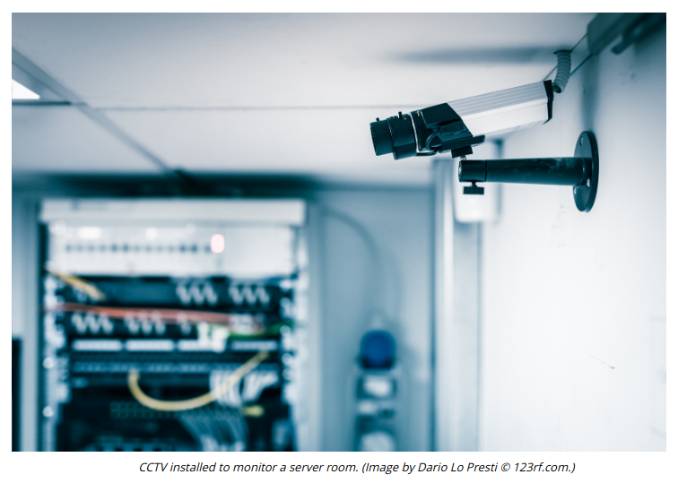

# SECURITY GUARDS AND CAMERAS

#### SECURITY GUARDS AND CAMERAS

Surveillance is typically a second layer of security designed to improve the resilience of perimeter gateways. Surveillance may be focused on perimeter areas or within security zones themselves. Human security guards, armed or unarmed, can be placed in front of and around a location to protect it. They can monitor critical checkpoints and verify identification, allow or disallow access, and log physical entry events. They also provide a visual deterrent and can apply their own knowledge and intuition to potential security breaches. The visible presence of guards is a very effective intrusion detection and deterrence mechanism, but is correspondingly expensive. It also may not be possible to place security guards within certain zones because they cannot be granted an appropriate security clearance. Training and screening of security guards is imperative.

**CCTV (closed circuit television)** is a cheaper means of providing surveillance than maintaining separate guards at each gateway or zone, though still not cheap to set up if the infrastructure is not already in place on the premises. It is also quite an effective deterrent. The other big advantage is that movement and access can be recorded. The main drawback compared to the presence of security guards is that response times are longer, and security may be compromised if not enough staff are in place to monitor the camera feeds.

The cameras in a CCTV network are typically connected to a multiplexer using coaxial cabling. The multiplexer can then display images from the cameras on one or more screens, allow the operator to control camera functions, and record the images to tape or hard drive. Newer camera systems may be linked in an IP network, using regular data cabling.

> _If you consider control types, a security guard is a preventive control, as the guard can both discover and act to prevent an attack. A camera is a detective control only._

Camera systems and robotics can use AI and machine learning to implement smart physical security (**theverge.com/2018/1/23/16907238/artificial-intelligence-surveillance-cameras-security**):

-   Motion recognition—the camera system might be configured with gait identification technology. This means that the system can generate an alert when anyone moves within sight of the camera and the pattern of their movement does not match a known and authorized individual.

-   Object detection—the camera system can detect changes to the environment, such as a missing server, or unknown device connected to a wall port.
-   **Robot sentries**—surveillance systems (and in some cases weapon systems) can be mounted on a wholly or partially autonomous robot (switch.com/switch-sentry).
-   Drones/UAV—cameras mounted on drones can cover wider areas than ground-based patrols (zdnet.com/article/best-security-surveillance-drones-for-business).