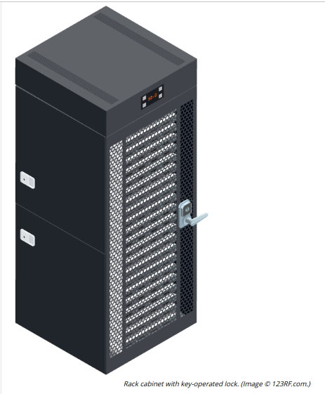
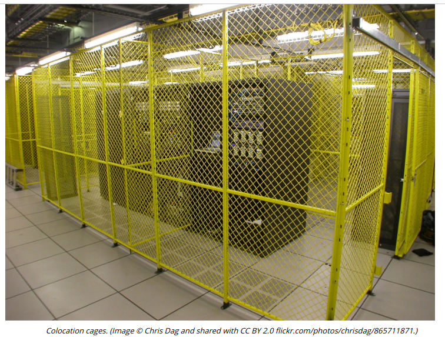

# SECURE AREAS

#### SECURE AREAS

A secure area is designed to store critical assets with a higher level of access protection than general office areas. The most vulnerable point of the network infrastructure will be the communications or server room. This should be subject to the most stringent access and surveillance controls that can be afforded. Similar measures apply to hardening access to data centers.

Installing equipment within secure cabinets/enclosures provides mitigation against insider attack and attacks that have broken through the perimeter security mechanisms. These can be supplied with key-operated or electronic locks.

Some data centers may contain racks with equipment owned by different companies (colocation). These racks can be installed inside cages so that technicians can only physically access the racks housing their own company's servers and appliances.

**Air Gap/Demilitarized Zone**  

An **air gapped** host is one that is not physically connected to any network. Such a host would also normally have stringent physical access controls, such as housing it within a secure enclosure, validating any media devices connected to it, and so on.

An air gap within a secure area serves the same function as a demilitarized zone. It is an empty area surrounding a high-value asset that is closely monitored for intrusions. As well as being disconnected from any network, the physical space around the host makes it easier to detect unauthorized attempts to approach the asset. Security policies should prevent any unauthorized computing hosts or storage media from being carried into the DMZ.

**Safes and Vaults**  

Portable devices and media (backup tapes or USB media storing encryption keys, for instance) may be stored in a safe. Safes can feature key-operated or combination locks but are more likely to come with electronic locking mechanisms. Safes can be rated to a particular cash value for the contents against various international grading schemes. There are also fire safes that give a certain level of protection against exposure to smoke and flame and to water penetration (from fire extinguishing efforts).

A **vault** is a room that is hardened against unauthorized entry by physical means, such as drilling or explosives. A vault is expensive, but may be considered necessary for mission critical assets that need to be very securely air gapped, such as the root server for a commercial CA.