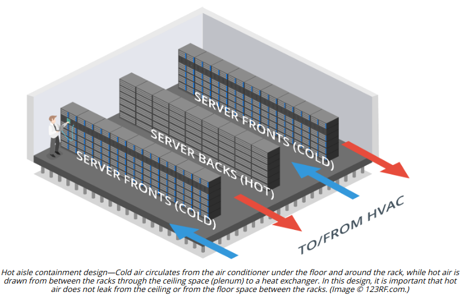

# HOT AND COLD AISLES

#### HOT AND COLD AISLES

A data center or server room should be designed in such a way as to maximize air flow across the server or racks. If multiple racks are used, install equipment so that servers are placed back-to-back not front-to-back, so that the warm exhaust from one bank of servers is not forming the air intake for another bank. This is referred to as a **hot aisle/cold aisle** arrangement. In order to prevent air leaks from the hot aisle to the cold aisle, ensure that any gaps in racks are filled by blank panels and use strip curtains or excluders to cover any spaces above or between racks.

Make sure that cabling is secured by cable ties or ducting and does not run across walkways. Cable is best run using a raised floor. If running cable through plenum spaces, make sure it is fire-retardant and be conscious of minimizing proximity to electrical sources, such as electrical cable and fluorescent light, which can corrupt data signals **(Electromagnetic Interference \[EMI\])**. You also need to ensure that there is sufficient space in the plenum for the air conditioning system to work properly—filling the area with cable is not the best idea.

> _To reduce interference, data/network cabling should not be run parallel to power cabling. If EMI is a problem, shielded cabling can be installed. Alternatively, the copper cabling could be replaced with fiber optic cabling, which is not susceptible to EMI._